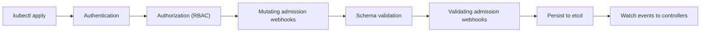
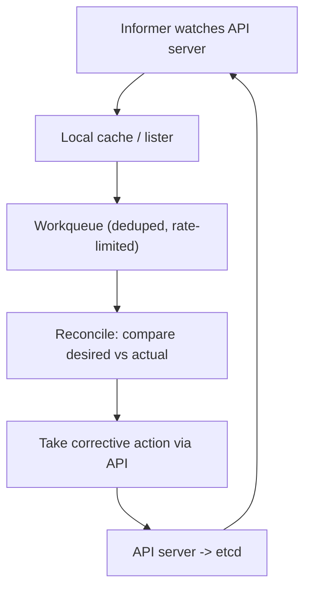

# Module 1 — Architecture & Mental Model

## TL;DR

Kubernetes is a **declarative, level-triggered control system**. You write the desired state to the API server; it persists to etcd; independent controllers watch for differences and drive actual state toward desired state in a never-ending **reconciliation loop**. There is no central orchestrator issuing commands — there are many small controllers each owning one resource type. Internalize this and 90% of Kubernetes behavior becomes predictable.

## Concept

Kubernetes (K8s) orchestrates containers across many machines: scheduling, health-checking, networking, scaling, rolling updates, and self-healing. The key architectural decision is that it is **declarative, not imperative**. You do not say "start 3 pods"; you declare "I want 3 replicas" and a controller continuously makes that true — even after node failures, evictions, or manual deletions.

**Level-triggered vs edge-triggered** is the single most important distinction. Edge-triggered systems react to *events* ("pod deleted"); if they miss the event, state drifts forever. Kubernetes is **level-triggered**: controllers periodically observe the *current level* (full desired vs actual) and correct any difference, so a missed event is self-healing on the next resync. Watches are an optimization on top of this, not the source of truth.

## How It Really Works (Internals)

### Control plane vs data plane

| Layer | Components | Role |
|-------|------------|------|
| **Control plane** | kube-apiserver, etcd, kube-scheduler, kube-controller-manager, cloud-controller-manager | Stores state, makes decisions |
| **Data plane** | kubelet, kube-proxy, container runtime (containerd/CRI-O) | Runs and connects workloads on each node |

- **kube-apiserver** — the *only* component that talks to etcd. Everything else (controllers, scheduler, kubelet, `kubectl`) talks to the API server. It is stateless and horizontally scalable; it does authentication, authorization, admission, validation, and serializes writes to etcd.
- **etcd** — a distributed, strongly-consistent key-value store using the **Raft** consensus protocol. It holds the entire cluster state. Every object is a key; the API server is the only client.
- **kube-scheduler** — watches for Pods with no `nodeName` and binds each to a node (filter then score, see Module 13).
- **kube-controller-manager** — runs dozens of controllers (Deployment, ReplicaSet, Node, Job, EndpointSlice, etc.) in one process, each a reconcile loop.
- **kubelet** — node agent; given Pods assigned to its node, it drives the container runtime via **CRI** to achieve the desired containers, and runs probes.
- **kube-proxy** — programs node networking so Service virtual IPs route to healthy Pod IPs (Module 4).

### The request lifecycle (write path)



Every write passes through this chain. Admission controllers (Module 8) can mutate (inject sidecars, defaults) or reject the object *before* it is persisted. This is where policy lives.

### The reconciliation loop (the core mental model)



A controller does not poll the API server in a tight loop. It uses an **informer**: an initial `LIST` to build a local cache, then a `WATCH` for incremental updates (tracked by `resourceVersion`). Changes are pushed onto a **workqueue** (deduplicated and rate-limited), and a worker calls `Reconcile(key)`. Reconcile is **idempotent** — it computes desired vs actual and acts; running it twice is harmless. A periodic **resync** re-lists everything so missed events self-heal (level-triggered).

### Object plumbing seniors are expected to know

- **resourceVersion + optimistic concurrency** — every object has a `resourceVersion`. Updates use compare-and-swap; if it changed underneath you, the write is rejected with a conflict and you re-read and retry. This is how concurrent controllers stay safe.
- **Owner references** — child objects (ReplicaSet → Deployment, Pod → ReplicaSet) carry `ownerReferences`. This enables **cascading deletion**: delete the Deployment and garbage collection removes its ReplicaSets and Pods.
- **Finalizers** — string keys on an object that *block* deletion. `deletionTimestamp` is set, but the object lingers until the responsible controller does cleanup (e.g. detach a volume, delete a cloud load balancer) and removes its finalizer. A stuck finalizer is the classic "namespace won't delete" cause.
- **Leader election** — controller-manager and scheduler run multiple replicas for HA but only one is active; they hold a Lease object and renew it. The rest stand by.

### Namespaces

Namespaces partition resources for grouping, RBAC scoping, and ResourceQuota/LimitRange boundaries. **They are not a security boundary by themselves** — without NetworkPolicy, Pods in different namespaces can still reach each other over the flat network. Some resources are cluster-scoped (Nodes, PersistentVolumes, ClusterRoles, CRDs) and live outside any namespace.

## Why / When / Trade-offs

- **Why declarative + level-triggered?** Self-healing and idempotency. The same manifest applied repeatedly converges to the same state, and the system recovers from missed events, restarts, and partial failures without manual intervention.
- **Why one giant etcd?** Strong consistency makes the API server's optimistic concurrency correct. The trade-off: etcd is the scaling bottleneck and the most precious thing to back up. Large clusters tune etcd heavily and sometimes split events into a separate etcd.
- **When the model bites you:** because controllers are eventually consistent, "I applied it but nothing happened yet" is normal — you are watching reconciliation lag, not a bug. Conversely, if you `kubectl edit` something a controller owns, it will be reverted on the next reconcile.

## Worked Scenario

You run `kubectl delete pod web-abc` on a Pod owned by a Deployment. What happens?

1. API server authenticates/authorizes the delete, sets `deletionTimestamp`, and (no finalizers here) removes the Pod from etcd.
2. The **ReplicaSet controller's** informer sees the Pod count drop to 2 (desired 3).
3. It reconciles: creates one new Pod with a generated name.
4. The **scheduler** sees an unscheduled Pod and binds it to a node.
5. The **kubelet** on that node pulls the image and starts the container.

You never "restarted" anything — you observed the reconciliation loop heal a difference. This is why deleting a Pod is a safe, routine operation.

## Gotchas & Failure Modes

- **Namespace stuck in `Terminating`** — almost always a finalizer whose controller is gone or failing. Inspect `kubectl get ns <n> -o yaml` and look at `spec.finalizers` / object finalizers.
- **`kubectl edit` changes silently revert** — you edited a field owned by a controller; edit the parent (Deployment), not the child (Pod/ReplicaSet).
- **etcd is the SPOF for state** — losing etcd quorum makes the cluster read-only/unavailable for writes. Back it up (Module 14).
- **"componentstatuses" is deprecated** — use `/readyz`, `/livez`, `/healthz` endpoints instead.
- **API server availability == control-plane availability** — if it is down, running Pods keep running (kubelet is autonomous), but nothing new schedules, scales, or self-heals.

## Interview Q&A

**Q: Walk me through what happens when you `kubectl apply` a Deployment.**
A: The request hits the API server, goes through authn → authz (RBAC) → mutating admission → schema validation → validating admission, then is persisted to etcd. The Deployment controller's informer observes the new object and reconciles by creating/adjusting a ReplicaSet; the ReplicaSet controller creates Pods; the scheduler binds each Pod to a node; the kubelet on that node starts the containers via CRI. Each step is an independent level-triggered loop.

**Q: What does "level-triggered" mean and why does Kubernetes use it?**
A: Controllers act on the observed current state versus desired state, not on individual events. So a missed or duplicated event doesn't cause permanent drift — the next observation/resync corrects it. It makes the system self-healing and reconciliation idempotent.

**Q: Why can't I just edit a Pod managed by a Deployment?**
A: The ReplicaSet controller owns those Pods and reconciles them to match the Deployment's Pod template. Your manual change is a difference it will revert. You change the desired state at the Deployment level instead.

**Q: What is a finalizer and when have you debugged one?**
A: A finalizer is a key that blocks hard deletion until a controller performs cleanup and removes it. Common real-world case: a namespace or PVC stuck in Terminating because the owning controller (or a CRD's operator) is gone, leaving the finalizer unremoved.

**Q: How do two controllers writing the same object avoid clobbering each other?**
A: Optimistic concurrency via `resourceVersion`. Updates are compare-and-swap; a stale write is rejected with a 409 Conflict and the controller re-reads and retries.

**Q: If the API server goes down, do my apps go down?**
A: Not immediately. kubelets keep running existing Pods autonomously. But you lose scheduling, scaling, self-healing, and any control-plane-driven action until it recovers. It's a control-plane outage, not necessarily a data-plane one.

## Verify

```bash
# Health endpoints (componentstatuses is deprecated)
kubectl get --raw='/readyz?verbose'

# Nodes and their roles
kubectl get nodes -o wide

# Control plane pods (kubeadm/kind style clusters)
kubectl get pods -n kube-system

# See owner references and the controller chain
kubectl get pods -n study -o jsonpath='{range .items[*]}{.metadata.name}{" -> "}{.metadata.ownerReferences[0].kind}{"\n"}{end}'

# Watch reconciliation in real time: delete a pod, watch the replacement
kubectl get pods -n study -w

# Inspect a stuck namespace's finalizers
kubectl get ns <name> -o jsonpath='{.spec.finalizers}'
```

## Further Reading

- [Kubernetes Components](https://kubernetes.io/docs/concepts/overview/components/)
- [Controllers](https://kubernetes.io/docs/concepts/architecture/controller/)
- [Owners and Dependents / Garbage Collection](https://kubernetes.io/docs/concepts/architecture/garbage-collection/)
- [Finalizers](https://kubernetes.io/docs/concepts/overview/working-with-objects/finalizers/)
- [API Concepts (resourceVersion, watch)](https://kubernetes.io/docs/reference/using-api/api-concepts/)
