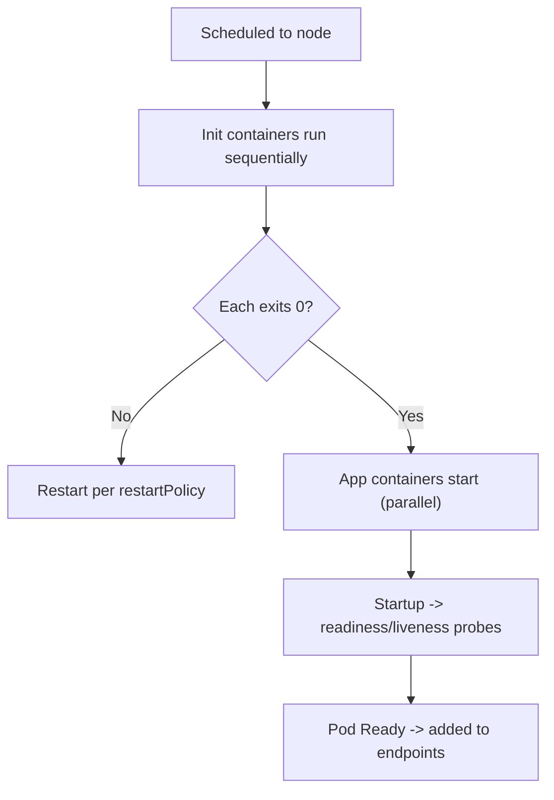
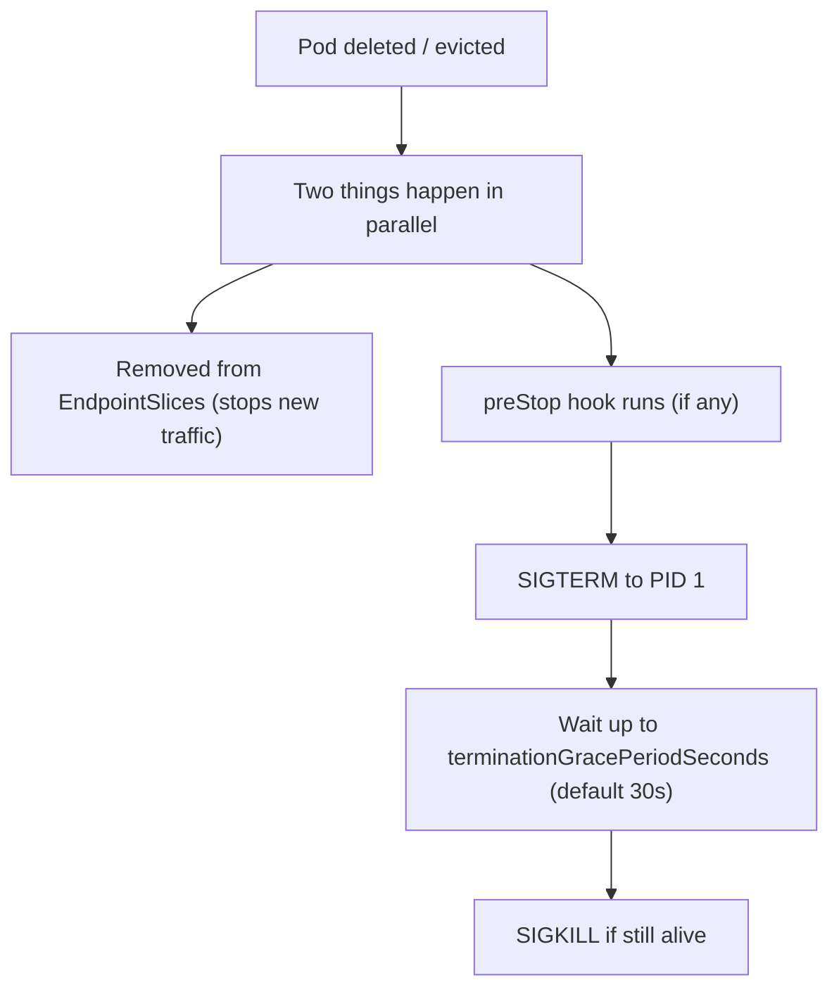

# Module 2 — Pods

## TL;DR

A Pod is a **shared execution context** — one or more containers that share a network namespace (one IP, shared `localhost`), optionally share volumes and IPC, and are always co-scheduled on one node. A hidden **pause container** holds the namespaces so app containers can come and go. Pods are cattle, not pets: ephemeral, replaceable, and identified by labels — never by IP.

## Concept

The Pod is the smallest schedulable unit. Containers in a Pod:

- Share one **network namespace** → same IP, reach each other over `localhost:<port>`.
- Can share **volumes** (and optionally the **IPC** and **PID** namespaces).
- Are scheduled **together** on the same node and live/die as a unit (for scheduling and IP purposes).

You almost never create bare Pods in production — a controller (Deployment/StatefulSet/etc., Module 3) creates them so they self-heal.

## How It Really Works (Internals)

### The pause container and shared namespaces

When a Pod starts, the kubelet first creates an infrastructure container — the **pause container**. It does nothing but hold open the Linux **network and IPC namespaces**. App containers then join those namespaces. This is why containers in a Pod share an IP and can restart independently without the Pod losing its network identity: the pause container keeps the namespaces alive.

Isolation is built from standard Linux primitives:

- **namespaces** (net, pid, ipc, mnt, uts) → what a process can *see*.
- **cgroups** → how much CPU/memory it can *use* (this is where requests/limits are enforced, Module 7).
- The kubelet speaks **CRI** (Container Runtime Interface, gRPC) to the runtime (containerd/CRI-O), which uses **OCI** image and runtime specs to unpack images and run containers (via runc or a sandboxed runtime like gVisor/Kata).

### Lifecycle phases and container states

| Pod phase | Meaning |
|-----------|---------|
| `Pending` | Accepted but not all containers running (scheduling, image pull, init containers) |
| `Running` | Bound to a node, at least one container running |
| `Succeeded` | All containers exited 0 and won't restart |
| `Failed` | All containers terminated, at least one non-zero |
| `Unknown` | Node unreachable |

Phase is coarse. The real signal is **container state** (`Waiting`/`Running`/`Terminated`) plus **Pod conditions** (`PodScheduled`, `Initialized`, `ContainersReady`, `Ready`). `Ready` is what gates Service traffic.

### Startup ordering



Init containers run **one at a time, to completion, in order** before any app container starts — used for migrations, waiting on dependencies, fixing permissions. Sidecars (the native `initContainers` with `restartPolicy: Always`, GA in 1.29+) start before app containers but keep running alongside them.

### Termination sequence (high-value interview topic)



The **race that causes 5xx during rollouts**: endpoint removal and SIGTERM are asynchronous and eventually consistent. A proxy may still send a request to a Pod that already got SIGTERM. The fix is a `preStop` sleep (e.g. `sleep 5`) so the Pod keeps serving while endpoint removal propagates, and an app that handles SIGTERM by draining in-flight requests. `terminationGracePeriodSeconds` must exceed your longest in-flight request + drain time.

### Labels, selectors, annotations

- **Labels** — identifying key/values used for **selection** (`app=api`, `tier=backend`). Services, controllers, and `kubectl -l` select on them. Changing a Pod's labels can silently detach it from its Service or ReplicaSet.
- **Annotations** — non-identifying metadata (build SHA, owner, checksum to force rollout, tool config). Not selectable.

## YAML Example

```yaml
apiVersion: v1
kind: Pod
metadata:
  name: app-with-init
  namespace: study
  labels:
    app: web
    tier: frontend
spec:
  terminationGracePeriodSeconds: 30
  initContainers:
    - name: wait-for-db
      image: busybox:1.36
      command: ['sh', '-c', 'until nc -z db 5432; do echo waiting; sleep 2; done']
  containers:
    - name: app
      image: nginx:1.25-alpine
      ports:
        - containerPort: 80
      lifecycle:
        preStop:
          exec:
            command: ["sh", "-c", "sleep 5"]   # let endpoint removal propagate
      resources:
        requests: { cpu: 100m, memory: 64Mi }
        limits:   { memory: 128Mi }
```

## Why / When / Trade-offs

- **Why multiple containers in one Pod?** Tight coupling: shared volume/network and same lifecycle. Use it for sidecars (log shippers, mesh proxies), adapters, and ambassadors. **Don't** use it just to "group" unrelated services — that couples their scaling and failure domains. Separate concerns that scale independently into separate Pods.
- **Init vs sidecar:** init = must finish before app starts (one-shot). Sidecar = runs for the Pod's lifetime alongside the app.
- **Bare Pod vs controller:** a bare Pod is not recreated if its node dies — no self-healing. Always use a controller in production.

## Worked Scenario

A service returns intermittent 502s only during deploys. Investigation: the app exits immediately on SIGTERM and has no `preStop`. During termination, the Pod is sent SIGTERM and dies in <1s, but kube-proxy/Ingress on other nodes still have it in their endpoint set for a moment and route requests to a dead Pod. Fix: add a `preStop: sleep 5`, handle SIGTERM in the app to stop accepting new connections but finish in-flight ones, and set `terminationGracePeriodSeconds` above the longest request. 502s disappear.

## Gotchas & Failure Modes

- **No `preStop` + instant exit** → 5xx during rollouts (above).
- **Changing labels** detaches a Pod from its owner/Service without an error.
- **CPU limit causing throttling** is silent — the Pod isn't killed, it just gets slow (Module 7).
- **Multiple containers, wrong `-c`** — `kubectl logs`/`exec` default to the first container; specify `-c` for sidecars.
- **`restartPolicy`** only `Always`/`OnFailure`/`Never`; `Always` is required for Deployments. Restarts are of the *container* in place, not rescheduling the Pod.
- **Pod IP changes** on every recreate — never hardcode it; use Service DNS.

## Interview Q&A

**Q: What does a Pod actually share between its containers?**
A: The network namespace (one IP, shared loopback and port space) and IPC namespace via the pause container, plus any volumes you mount into multiple containers. Optionally the PID namespace. Each container still has its own filesystem (unless sharing a volume) and its own cgroup limits.

**Q: Describe the Pod termination sequence and how you avoid dropped requests.**
A: On deletion, endpoint removal and the shutdown sequence happen in parallel: the Pod is removed from EndpointSlices while `preStop` runs, then SIGTERM is sent, then after the grace period SIGKILL. Because endpoint removal is eventually consistent, I add a `preStop` sleep and handle SIGTERM to drain in-flight requests, with `terminationGracePeriodSeconds` longer than the longest request.

**Q: Init container vs sidecar?**
A: Init containers run sequentially to completion before app containers start (migrations, dependency waits). Sidecars run for the whole Pod lifetime next to the app (log/metric shippers, proxies); natively modeled as init containers with `restartPolicy: Always`.

**Q: Why are bare Pods discouraged?**
A: They have no controller, so if the node fails the Pod is gone — no rescheduling or self-healing. Controllers (Deployment/StatefulSet) maintain desired replica count.

**Q: What's the difference between a Pod being Running and being Ready?**
A: Running means containers are up. Ready means readiness probes pass and the Pod's `Ready` condition is true, which is what adds it to Service endpoints. A Running-but-not-Ready Pod receives no traffic.

## Verify

```bash
kubectl run demo --image=nginx:1.25-alpine -n study
kubectl get pod demo -n study -o wide                      # see node + IP
kubectl get pod demo -n study -o jsonpath='{.status.conditions}'  # PodScheduled/Ready/etc
kubectl describe pod demo -n study                         # events, state, last state
kubectl logs demo -n study -c <container>                  # specify container
kubectl delete pod demo -n study --grace-period=30
```

## Further Reading

- [Pods](https://kubernetes.io/docs/concepts/workloads/pods/)
- [Pod Lifecycle (phases, conditions, termination)](https://kubernetes.io/docs/concepts/workloads/pods/pod-lifecycle/)
- [Init Containers](https://kubernetes.io/docs/concepts/workloads/pods/init-containers/)
- [Sidecar Containers](https://kubernetes.io/docs/concepts/workloads/pods/sidecar-containers/)
- [Container Runtime Interface (CRI)](https://kubernetes.io/docs/concepts/architecture/cri/)
