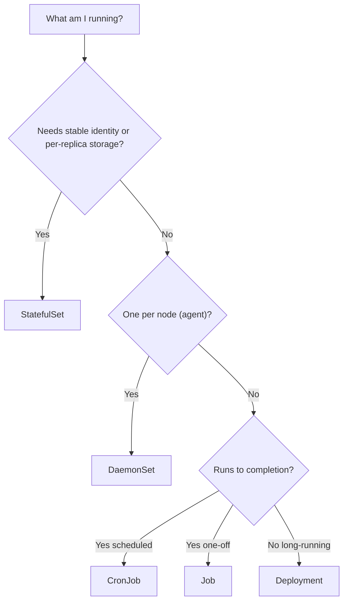

# Module 3 — Workload Controllers

## TL;DR

You declare workloads through controllers, not raw Pods. **Deployment** = stateless, interchangeable replicas with rolling updates (via a managed ReplicaSet). **StatefulSet** = stable identity + stable per-Pod storage + ordered operations. **DaemonSet** = one Pod per node. **Job/CronJob** = run-to-completion / scheduled. The controller you pick dictates your upgrade strategy, storage model, and networking — choose it from the app's requirements, not habit.

## Concept

A controller maintains desired replica count and update strategy so Pods self-heal. The decision tree:



## How It Really Works (Internals)

### Deployment → ReplicaSet → Pods

A Deployment does **not** manage Pods directly. It manages **ReplicaSets**; each ReplicaSet manages Pods. On a spec change (e.g. new image), the Deployment controller creates a *new* ReplicaSet and scales it up while scaling the old one down per the rollout strategy. This two-level design is what makes rollbacks instant — the old ReplicaSet still exists at 0 replicas and can be scaled back up.

ReplicaSets are named with a **pod-template-hash** (a hash of the Pod template) appended, e.g. `web-7d9f8c6b5`. The same hash is added as a label/selector so each ReplicaSet only owns Pods from its template revision. Change the template → new hash → new ReplicaSet.

### Rolling update math

```yaml
strategy:
  type: RollingUpdate
  rollingUpdate:
    maxSurge: 1          # extra Pods above desired during rollout (count or %)
    maxUnavailable: 0    # Pods allowed below desired during rollout (count or %)
```

With `replicas: 3, maxSurge: 1, maxUnavailable: 0`: the controller adds 1 new Pod (surge to 4), waits for it to become **Ready**, then deletes 1 old Pod, and repeats. `maxUnavailable: 0` guarantees full capacity throughout (zero-downtime) at the cost of needing 1 extra Pod's resources. Setting `maxUnavailable: 25%` is faster but runs degraded. **Readiness probes gate the rollout** — a new Pod that never becomes Ready stalls the rollout instead of taking traffic.

### StatefulSet guarantees

- **Stable network identity:** Pod `n` is always `<sts>-<n>` with DNS `<sts>-<n>.<headless-svc>.<ns>.svc.cluster.local`. Survives reschedule.
- **Stable storage:** `volumeClaimTemplates` creates one PVC per ordinal (`data-<sts>-0`). The PVC is **not** deleted when the Pod or even the StatefulSet is deleted (by default) — the data follows the identity.
- **Ordered operations:** default `podManagementPolicy: OrderedReady` creates 0,1,2 in order (each Ready before the next) and terminates in reverse. `Parallel` drops the ordering for faster scale.
- **Rolling updates** go in reverse ordinal order and support **`partition`**: with `partition: 2`, only ordinals ≥ 2 update — a built-in canary for stateful apps.

### DaemonSet

Runs one Pod per matching node; the DaemonSet controller (not the default scheduler historically) places them, and new nodes automatically get the Pod. Used for node-exporter, log agents (Fluent Bit), CNI agents, CSI node plugins. Respects taints via tolerations (often tolerates everything to run on all nodes).

### Job / CronJob

- **Job:** runs Pods until `completions` succeed. `parallelism` controls concurrency. `backoffLimit` caps retries; `ttlSecondsAfterFinished` auto-cleans finished Jobs. Use `restartPolicy: OnFailure` or `Never`.
- **CronJob:** creates a Job on a cron schedule. `concurrencyPolicy` (Allow/Forbid/Replace) and `startingDeadlineSeconds` handle overlap and missed runs.

## Comparison

| Controller | Identity | Storage | Update order | Scale concern |
|------------|----------|---------|--------------|---------------|
| Deployment | Interchangeable, random names | External/none | Rolling, any order | Trivial |
| StatefulSet | Stable `name-ordinal` | Per-ordinal PVC, retained | Reverse order, `partition` canary | Ordered, slower |
| DaemonSet | One per node | hostPath/none | Per node | Tied to node count |
| Job/CronJob | Random | Ephemeral | N/A | `parallelism`/`completions` |

## Why / When / Trade-offs

- **Deployment for anything stateless** — APIs, web, workers behind a queue. The default, cheapest to operate.
- **StatefulSet only when you truly need identity/storage** — databases, Kafka, ZooKeeper, etcd. It is slower to roll and operationally heavier; don't reach for it just because your app "has state" if that state lives in an external DB.
- **`maxUnavailable: 0` vs speed** — zero-downtime requires surge headroom; if the cluster is tight on resources the rollout can't surge and stalls.
- **Job vs long-running Deployment** — for batch, a Job gives you completion semantics, retries, and cleanup; a Deployment would just restart forever.

## Worked Scenario

A team runs PostgreSQL as a Deployment with a single PVC and `replicas: 1`. During a node drain the Pod reschedules, but the rollout strategy briefly creates a second Pod that tries to mount the same RWO volume → it stays `ContainerCreating` (multi-attach error), and worse, two processes could touch the data. Correct design: a **StatefulSet** with `volumeClaimTemplates` (each replica its own volume), `OrderedReady` management, a **headless Service** for stable DNS, and a PDB. Even at one replica, StatefulSet's `Recreate`-like ordering avoids the double-attach window.

## Gotchas & Failure Modes

- **Rollout stuck** — new Pods never become Ready (bad image, failing readiness, insufficient resources to surge). `kubectl rollout status` hangs; `kubectl describe`/`get events` shows why.
- **Editing a ReplicaSet directly** — reverted by the Deployment controller. Change the Deployment.
- **StatefulSet PVCs linger** after deletion by design — you must delete them explicitly to reclaim storage.
- **Deployment for stateful apps** → multi-attach errors, data races, broken clustering. Wrong tool.
- **CronJob pile-up** — default `concurrencyPolicy: Allow` lets slow jobs overlap; use `Forbid`/`Replace` if runs shouldn't stack.
- **`latest` tag** — no new pod-template-hash if the tag string didn't change, so `kubectl apply` may not trigger a rollout even though the image moved. Pin tags/digests.

## Interview Q&A

**Q: Why does a Deployment use a ReplicaSet instead of managing Pods directly?**
A: The intermediate ReplicaSet, keyed by a pod-template-hash, lets the Deployment do controlled rollouts and instant rollbacks: each revision is its own ReplicaSet, and rolling back just scales the old ReplicaSet up and the new one down.

**Q: Explain `maxSurge` and `maxUnavailable`.**
A: During a rolling update, `maxSurge` is how many Pods above desired you may temporarily run, and `maxUnavailable` is how many below desired. `maxUnavailable: 0` with `maxSurge: 1` gives zero-downtime by always adding a Ready Pod before removing an old one, at the cost of one extra Pod's resources.

**Q: When do you choose StatefulSet over Deployment?**
A: When Pods need stable network identity, stable per-replica persistent storage, or ordered startup/shutdown — databases, message brokers, quorum systems. Otherwise Deployment, which is simpler and faster to roll.

**Q: How would you canary a StatefulSet?**
A: Use the rolling update `partition`. Setting `partition` to N means only ordinals ≥ N get the new template; you raise the bar gradually, validating each step, until partition reaches 0 and all are updated.

**Q: A rollout is stuck. How do you diagnose it?**
A: `kubectl rollout status` to confirm, then `kubectl get pods` to see the new ReplicaSet's Pods, then `describe`/`logs --previous` on a failing Pod and `kubectl get events`. Usual causes: failing readiness probe, ImagePullBackOff, or no room to surge. Roll back with `kubectl rollout undo` if needed.

## Verify

```bash
kubectl apply -f labs/01-deployment/deployment.yaml
kubectl get deploy,rs,pods -n study -l app=web      # see the RS hash
kubectl rollout status deployment/web -n study
kubectl set image deployment/web nginx=nginx:1.26-alpine -n study
kubectl rollout history deployment/web -n study     # revisions = ReplicaSets
kubectl rollout undo deployment/web -n study        # scale old RS back up
kubectl get pods -n study -L pod-template-hash       # show the hash label
```

## Further Reading

- [Deployments](https://kubernetes.io/docs/concepts/workloads/controllers/deployment/)
- [StatefulSets](https://kubernetes.io/docs/concepts/workloads/controllers/statefulset/)
- [DaemonSet](https://kubernetes.io/docs/concepts/workloads/controllers/daemonset/)
- [Jobs](https://kubernetes.io/docs/concepts/workloads/controllers/job/) · [CronJob](https://kubernetes.io/docs/concepts/workloads/controllers/cron-jobs/)
