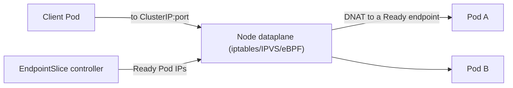

# Module 4 — Networking

## TL;DR

Kubernetes networking rests on one rule: **every Pod gets a unique IP and any Pod can reach any other Pod without NAT** (a flat network the CNI plugin implements). On top of that flat network, **Services** give stable virtual IPs and DNS to ephemeral Pods, **kube-proxy** (or eBPF) programs the load-balancing, **Ingress/Gateway** route L7 HTTP, and **NetworkPolicy** is the firewall. Debug top-down: DNS → Service → EndpointSlice → Pod → NetworkPolicy.

## Concept

The Kubernetes network model mandates:

1. Every Pod has its own IP.
2. Pods on any node can reach Pods on any node **without NAT**.
3. Agents on a node (kubelet) can reach Pods on that node.

The plugin that makes this true is the **CNI** (Calico, Cilium, Flannel, etc.). Kubernetes itself doesn't implement Pod networking — it delegates to CNI. Services and DNS are built *on top* of this flat network.

## How It Really Works (Internals)

### Service types

| Type | What you get | Use case |
|------|--------------|----------|
| **ClusterIP** (default) | A stable virtual IP reachable only inside the cluster | Service-to-service |
| **NodePort** | ClusterIP + a port (30000–32767) open on every node | Dev, or behind an external LB |
| **LoadBalancer** | NodePort + a cloud provisioner creates an external LB | Public ingress on cloud |
| **Headless** (`clusterIP: None`) | No VIP; DNS returns Pod IPs directly | StatefulSet peer discovery, client-side LB |
| **ExternalName** | DNS CNAME to an external host | Aliasing external services |

### How a ClusterIP actually routes (kube-proxy)

A Service's ClusterIP is **virtual** — no process listens on it. kube-proxy watches Services and EndpointSlices and programs the node's dataplane so packets to the ClusterIP are DNAT'd to a real Pod IP:

- **iptables mode** (default): installs iptables rules; selects a backend with statistical probability. Simple and ubiquitous, but rule evaluation is O(n) in the number of Services — slow to update on very large clusters.
- **IPVS mode**: uses the kernel's in-kernel L4 load balancer (hash tables, O(1) lookup) with real LB algorithms (rr, lc, etc.). Scales to thousands of Services.
- **eBPF** (Cilium, or kube-proxy replacement): programs the dataplane with eBPF, bypassing iptables entirely — lowest latency, best scale, and enables identity-based policy.



### EndpointSlices

The Service's selector matches Pods; the **EndpointSlice controller** writes the set of Ready Pod IPs into EndpointSlice objects (sharded, ~100 endpoints each — the modern replacement for the single Endpoints object that didn't scale). kube-proxy consumes these. **Only Ready Pods appear** — this is the link between readiness probes (Module 7) and traffic.

### DNS and service discovery

**CoreDNS** runs as a Deployment; every Pod's `/etc/resolv.conf` points at the kube-dns Service IP. Records:

```
<service>.<namespace>.svc.cluster.local        # ClusterIP
<pod-ordinal>.<headless-svc>.<ns>.svc.cluster.local  # headless per-Pod
```

The infamous **`ndots:5` pitfall**: resolv.conf has `options ndots:5` and a search list. A lookup of `api` (fewer than 5 dots) is first tried with each search domain appended (`api.study.svc.cluster.local`, `api.svc.cluster.local`, ...) before the bare name. An external name like `api.example.com` (2 dots) also walks the search list first → several failed lookups before success. This causes latency and CoreDNS load; fixes include fully-qualifying external names with a trailing dot (`api.example.com.`) or tuning `dnsConfig`.

### Ingress vs Gateway API

- **Ingress**: L7 HTTP(S) routing (host/path → Service) implemented by an ingress controller (nginx, Traefik, HAProxy). TLS terminates here or at an upstream LB. Annotations carry controller-specific behavior — the weakness Gateway API fixes.
- **Gateway API**: the newer, role-oriented, more expressive successor (GatewayClass/Gateway/HTTPRoute) — portable across implementations, supports traffic splitting, header routing natively. Mention it as the direction of travel.

### NetworkPolicy

Default behavior: **all traffic allowed**. A NetworkPolicy selecting a Pod switches that Pod to **default-deny for the specified direction** (Ingress and/or Egress), and you then whitelist. Policies are additive (OR'd). Requires a CNI that enforces them (Calico, Cilium; kind's default does). A production baseline is a default-deny-all policy per namespace plus explicit allows.

## YAML Example

```yaml
apiVersion: v1
kind: Service
metadata: { name: web, namespace: study }
spec:
  type: ClusterIP
  selector: { app: web }
  ports:
    - port: 80          # the Service port clients hit
      targetPort: 8080  # the container port
---
apiVersion: networking.k8s.io/v1
kind: NetworkPolicy
metadata: { name: default-deny-ingress, namespace: study }
spec:
  podSelector: {}        # all pods in namespace
  policyTypes: [Ingress] # deny all ingress unless another policy allows
```

## Why / When / Trade-offs

- **ClusterIP vs Headless:** ClusterIP load-balances behind one VIP (good for stateless). Headless returns all Pod IPs so the client picks (good for StatefulSets, gRPC client-side LB, or when you need per-Pod addressing).
- **iptables vs IPVS vs eBPF:** iptables is fine to a point; switch to IPVS/eBPF when Service count or churn makes iptables updates a bottleneck or you need lower latency.
- **NodePort/LoadBalancer vs Ingress:** one LoadBalancer per Service is expensive on cloud; an Ingress controller fronts many Services behind a single LB with L7 routing.
- **`externalTrafficPolicy: Local` vs `Cluster`:** `Local` preserves the client source IP and avoids a second hop but can imbalance traffic; `Cluster` spreads load but SNATs the source IP.

## Worked Scenario

"Service is unreachable." Methodical top-down debug:

1. **DNS:** `kubectl run tmp --rm -it --image=curlimages/curl -- nslookup web.study` — resolves? If not, CoreDNS or search-domain issue.
2. **Service exists & has endpoints:** `kubectl get endpointslices -n study -l kubernetes.io/service-name=web`. **Empty endpoints is the #1 cause** — means no Ready Pod matches the selector.
3. **Selector vs labels:** compare `kubectl get svc web -o yaml` `selector` to `kubectl get pods --show-labels`. A typo here silently yields zero endpoints.
4. **Readiness:** Pods Running but not Ready won't appear in endpoints — check probes.
5. **Port mapping:** `targetPort` must match the container's actual listening port.
6. **NetworkPolicy:** a default-deny without an allow rule blocks it — `kubectl get networkpolicy -n study`.

## Gotchas & Failure Modes

- **Selector/label mismatch** → empty EndpointSlice → connection refused/timeout.
- **`port` vs `targetPort`** confusion — clients hit `port`; it forwards to `targetPort` on the Pod.
- **`ndots:5`** → slow external DNS; fully-qualify or tune `dnsConfig`.
- **NetworkPolicy needs a supporting CNI** — applying one on a CNI that ignores policy gives false security.
- **Headless Service has no VIP** — `nslookup` returns multiple A records; load balancing is the client's job.
- **`externalTrafficPolicy: Local`** drops traffic to nodes with no local Pod (intended, but surprising).

## Interview Q&A

**Q: How does a request to a ClusterIP actually reach a Pod?**
A: The ClusterIP is virtual — kube-proxy (iptables/IPVS) or an eBPF dataplane on the node DNATs the packet to one of the Service's Ready endpoint Pod IPs, which the EndpointSlice controller maintains from the Service selector. With eBPF, iptables is bypassed entirely.

**Q: What's the difference between iptables and IPVS mode?**
A: iptables installs linear-ish rule chains and picks a backend probabilistically — simple but O(n) to evaluate/update at scale. IPVS uses the kernel's L4 load balancer with hash tables (O(1)) and real algorithms, scaling to thousands of Services with faster updates.

**Q: A Service has no endpoints. What are the causes?**
A: No Pod matches the selector (label/selector mismatch), or matching Pods aren't Ready (failing readiness probe), or the Pods aren't running at all. Only Ready Pods are written into EndpointSlices.

**Q: Explain the ndots problem.**
A: resolv.conf sets `ndots:5` with a search list. Names with fewer dots are tried with each search domain appended first, so external lookups generate several failed queries before resolving — adding latency and CoreDNS load. Fix by fully-qualifying (trailing dot) or adjusting `dnsConfig`.

**Q: When would you use a headless Service?**
A: When clients need direct Pod addressing rather than a single VIP — StatefulSet peer discovery (each Pod's stable DNS), client-side load balancing, or protocols like gRPC that balance per-connection.

**Q: How does NetworkPolicy default behavior work?**
A: With no policy, all traffic is allowed. The moment a policy selects a Pod for a direction, that direction becomes default-deny for that Pod and only explicitly listed sources/destinations are allowed. Policies are additive. Enforcement depends on the CNI.

## Verify

```bash
kubectl get svc,endpointslices -n study
kubectl get endpointslices -n study -l kubernetes.io/service-name=web -o wide
kubectl run curl --rm -it --image=curlimages/curl -n study -- curl -s http://web
kubectl run dns --rm -it --image=busybox:1.36 -n study -- nslookup web.study.svc.cluster.local
kubectl describe ingress -n study
kubectl get networkpolicy -n study
```

## Further Reading

- [Service](https://kubernetes.io/docs/concepts/services-networking/service/) · [EndpointSlices](https://kubernetes.io/docs/concepts/services-networking/endpoint-slices/)
- [Virtual IPs and Service Proxies (kube-proxy modes)](https://kubernetes.io/docs/reference/networking/virtual-ips/)
- [DNS for Services and Pods](https://kubernetes.io/docs/concepts/services-networking/dns-pod-service/)
- [Ingress](https://kubernetes.io/docs/concepts/services-networking/ingress/) · [Gateway API](https://gateway-api.sigs.k8s.io/)
- [Network Policies](https://kubernetes.io/docs/concepts/services-networking/network-policies/)
