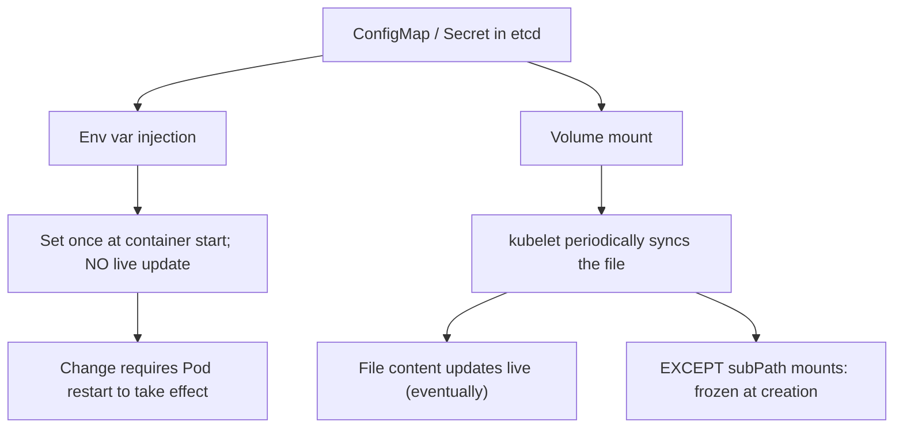

# Module 5 — Configuration & Secrets

## TL;DR

Externalize config so the same image runs in every environment. **ConfigMap** = non-sensitive config; **Secret** = sensitive data that is only **base64-encoded, not encrypted**, unless you enable encryption-at-rest. Mount as **env vars** (no live reload — needs a restart) or as a **volume** (files update live, except `subPath`). Treat read access to Secrets as equivalent to having the secret, and lock it down with RBAC.

## Concept

A 12-factor app reads config from the environment, not from baked-in files. Kubernetes provides two objects:

- **ConfigMap** — key/value config, small files, env values.
- **Secret** — same shape, but for credentials/tokens/certs, with extra handling (tmpfs mounts, type field, optional encryption).

The critical truth: **a Secret is not encrypted by default**. `type: Opaque` data is base64 in etcd. Anyone who can read the Secret via the API, or read etcd, sees the value. Security comes from **RBAC + encryption-at-rest + limiting who/what can read it**, not from the Secret object itself.

## How It Really Works (Internals)

### Injection methods and reload behavior



- **Env vars** (`envFrom`/`valueFrom`): resolved once when the container starts. Updating the ConfigMap does **not** change a running container's env — you must restart the Pod (`kubectl rollout restart`). This is by design (env is process-static on Linux).
- **Volume mounts**: the kubelet projects keys as files and refreshes them periodically (cache TTL, typically up to ~1 minute). An app that re-reads the file sees updates without a restart.
- **`subPath` gotcha**: a `subPath` mount copies the file at creation and is **not** updated on ConfigMap changes — a very common "why didn't my config reload" bug. Mount the whole directory if you need live updates.

### Forcing a rollout on config change

Because env-mounted config doesn't reload, teams add a checksum annotation to the Pod template (`checksum/config: <hash>`). When the ConfigMap changes, the hash changes, the Pod template changes, and the Deployment rolls — a clean way to propagate config. (Helm's `sha256sum` pattern.)

### Secret storage and encryption-at-rest

By default Secrets sit base64-encoded in etcd. **Encryption-at-rest** is configured on the API server via an `EncryptionConfiguration` that encrypts Secret (and optionally other) resources before writing to etcd, using `aescbc`/`secretbox` or, in production, a **KMS provider** (envelope encryption with an external KMS — AWS KMS, GCP KMS, Vault). Without this, an etcd backup is a plaintext secret dump.

### Mount types and projected volumes

Secrets mounted as volumes land on **tmpfs** (memory-backed), so they're not written to node disk. **Projected volumes** combine multiple sources (ConfigMap + Secret + a **bound ServiceAccount token** with an audience and expiry) into one directory — the modern way ServiceAccount tokens are delivered (Module 8).

### Immutable ConfigMaps/Secrets

Setting `immutable: true` (1.21+) prevents updates and lets the kubelet stop watching them — reducing API server load at scale and preventing accidental `kubectl apply` overwrites. To change one, you create a new object and roll the Deployment to it.

## YAML Example

```yaml
apiVersion: v1
kind: ConfigMap
metadata: { name: app-config, namespace: study }
data:
  APP_MODE: production
  config.yaml: |
    logLevel: info
---
apiVersion: v1
kind: Secret
metadata: { name: app-secret, namespace: study }
type: Opaque
stringData:               # plaintext here; API stores base64
  DB_PASSWORD: "rotate-me"
---
apiVersion: v1
kind: Pod
metadata: { name: cfg-demo, namespace: study }
spec:
  containers:
    - name: app
      image: busybox:1.36
      command: ["sh","-c","echo mode=$APP_MODE; cat /etc/cfg/config.yaml; sleep 3600"]
      envFrom:
        - configMapRef: { name: app-config }     # env: no live reload
      env:
        - name: DB_PASSWORD
          valueFrom:
            secretKeyRef: { name: app-secret, key: DB_PASSWORD }
      volumeMounts:
        - name: cfg
          mountPath: /etc/cfg                      # whole dir: live reload
          readOnly: true
  volumes:
    - name: cfg
      configMap: { name: app-config }
```

## Why / When / Trade-offs

- **Env var vs volume:** env is simplest for flat key/values consumed at boot; volume is right for config files, TLS certs, and anything you want to hot-reload. Env exposes values in `kubectl describe`/child processes; volumes keep them in files.
- **In-cluster Secret vs external manager:** native Secrets are easy but live in etcd and Git is a bad place for them. For real rotation, audit, and central control use **External Secrets Operator** (syncs from Vault/AWS SM/GCP SM), **Sealed Secrets** (encrypt manifests for GitOps), or **Vault Agent** injection.
- **Immutable:** great for prod stability and scale; costs you the ability to edit in place.

## Worked Scenario

A team updates a ConfigMap with a new feature flag and is confused that running Pods don't pick it up. The flag is injected via `envFrom`, so it's frozen at container start. Two fixes: (1) `kubectl rollout restart deployment/app` to recreate Pods, or (2) switch the flag to a **volume mount** and have the app watch the file. They also discover a second value mounted via `subPath` that *still* won't update even after switching to a volume — because `subPath` snapshots at creation. They mount the directory instead.

## Gotchas & Failure Modes

- **Env config doesn't hot-reload** — restart required; people forget and think the change failed.
- **`subPath` never updates** on ConfigMap/Secret change.
- **Secrets are base64, not encrypted** — don't treat base64 as protection; enable encryption-at-rest + KMS.
- **Committing Secrets to Git** — use Sealed Secrets/ESO instead; plaintext in Git is a breach.
- **Over-broad RBAC on `secrets`** — `get`/`list` on Secrets is effectively read-the-credentials; scope it tightly.
- **Large ConfigMaps** (>1MB) hit etcd limits and slow watches.

## Interview Q&A

**Q: Are Kubernetes Secrets encrypted?**
A: Not by default — they're base64-encoded in etcd, which is encoding, not encryption. You get real protection by enabling encryption-at-rest (ideally a KMS provider for envelope encryption) and restricting RBAC on the Secret resource. Anyone who can read the Secret or etcd otherwise sees plaintext.

**Q: If I update a ConfigMap, does my running Pod see the change?**
A: Depends on injection. Env vars are set once at start and don't update — you restart the Pod. Volume-mounted keys are refreshed by the kubelet within about a minute and an app re-reading the file sees them — except `subPath` mounts, which are frozen at creation.

**Q: How do you force a rollout when config changes but it's injected as env vars?**
A: Put a checksum of the ConfigMap/Secret as an annotation on the Pod template. When the config changes the checksum changes, the template changes, and the Deployment performs a normal rolling update.

**Q: How do you keep secrets out of Git in a GitOps setup?**
A: Encrypt them before they touch Git (Sealed Secrets) or keep only references in Git and sync the real values at runtime from an external store via the External Secrets Operator or Vault. The cluster decrypts/fetches; Git never holds plaintext.

**Q: Why mount a secret as a volume instead of an env var?**
A: Volumes land on tmpfs, support live rotation (re-read the file), avoid leaking the value into process listings/child env, and are the natural fit for TLS certs and large/structured secrets.

## Verify

```bash
kubectl apply -f labs/02-config/
kubectl exec cfg-demo -n study -- env | grep APP_MODE       # env value
kubectl exec cfg-demo -n study -- cat /etc/cfg/config.yaml  # file value
kubectl get secret app-secret -n study -o jsonpath='{.data.DB_PASSWORD}' | base64 -d
kubectl patch configmap app-config -n study --type merge -p '{"data":{"APP_MODE":"staging"}}'
kubectl rollout restart deployment/<app> -n study           # pick up env change
```

## Further Reading

- [ConfigMaps](https://kubernetes.io/docs/concepts/configuration/configmap/) · [Secrets](https://kubernetes.io/docs/concepts/configuration/secret/)
- [Encrypting Confidential Data at Rest](https://kubernetes.io/docs/tasks/administer-cluster/encrypt-data/) · [KMS provider](https://kubernetes.io/docs/tasks/administer-cluster/kms-provider/)
- [Projected Volumes](https://kubernetes.io/docs/concepts/storage/projected-volumes/)
- [External Secrets Operator](https://external-secrets.io/) · [Sealed Secrets](https://github.com/bitnami-labs/sealed-secrets)
