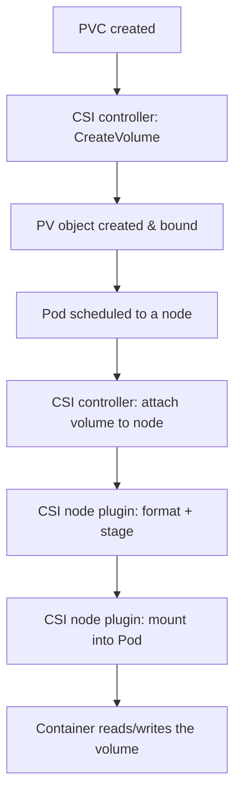

# Module 6 — Storage

## TL;DR

Container filesystems are ephemeral; persistent data lives in **PersistentVolumes (PV)** that Pods claim via **PersistentVolumeClaims (PVC)**. A **StorageClass** dynamically provisions a PV when a PVC is created, through a **CSI driver** (the pluggable storage interface). The hard parts are **access modes** (RWO is one-node-at-a-time, the usual default), **binding/topology** (the volume must be reachable from the Pod's node), and **reclaim policy** (does deleting the PVC delete the data?). Storage is the part of Kubernetes you cannot casually undo — plan retention deliberately.

## Concept

| Object | Role |
|--------|------|
| **PersistentVolume (PV)** | A piece of storage in the cluster (cloud disk, NFS export, local disk) |
| **PersistentVolumeClaim (PVC)** | A Pod's request: "I need 10Gi, RWO, from class fast" |
| **StorageClass** | A template + provisioner that creates PVs on demand |
| **CSI driver** | The vendor plugin that actually creates/attaches/mounts storage |
| **VolumeSnapshot** | A point-in-time copy, also via CSI |

A Pod references a PVC; the PVC binds to a PV; the PV is backed by real storage. The indirection lets app authors request storage abstractly while operators control how it's provisioned.

## How It Really Works (Internals)

### Static vs dynamic provisioning

- **Static**: an admin pre-creates PVs; a PVC binds to a matching one (size ≥ request, compatible access mode/class).
- **Dynamic** (the norm): the PVC names a StorageClass; the **external-provisioner** sidecar of the CSI driver sees the unbound PVC and creates a backing volume + PV automatically.

### CSI architecture

A CSI driver has two parts:

- **Controller plugin** (a Deployment): handles **CreateVolume / DeleteVolume** and **ControllerPublishVolume** (attach/detach to a node) — cluster-wide operations talking to the cloud/storage API.
- **Node plugin** (a DaemonSet): handles **NodeStageVolume / NodePublishVolume** — formatting and mounting the volume into the Pod on that specific node.



### Access modes (a frequent source of outages)

| Mode | Meaning | Reality |
|------|---------|---------|
| **RWO** (ReadWriteOnce) | Mounted read-write by a single **node** | Most block storage (EBS, PD). Two Pods on different nodes can't share it → multi-attach errors |
| **ROX** (ReadOnlyMany) | Many nodes, read-only | Static content |
| **RWX** (ReadWriteMany) | Many nodes, read-write | Needs a shared filesystem (NFS, CephFS, EFS) — most block storage can't do this |
| **RWOP** | ReadWriteOncePod | Restricts to a single **Pod**, not just node (1.22+) |

RWO is per-**node**, not per-Pod — a subtlety that matters when multiple Pods land on the same node.

### Binding mode and topology

`volumeBindingMode` on the StorageClass:

- **Immediate**: PV is provisioned as soon as the PVC exists — can provision in a zone where the Pod can't be scheduled (zone mismatch deadlock on multi-zone clusters).
- **WaitForFirstConsumer** (recommended): provisioning is delayed until a Pod using the PVC is scheduled, so the volume is created in the *right* zone/topology. This is why the lab StorageClass uses it.

### Reclaim policy

`persistentVolumeReclaimPolicy` on the PV:

- **Delete** (common default for dynamic): deleting the PVC deletes the PV and the **underlying data**. Convenient, dangerous.
- **Retain**: the PV (and data) persist after PVC deletion for manual recovery — what you want for anything precious.

### StatefulSet storage

`volumeClaimTemplates` creates one PVC per ordinal (`data-<sts>-0`). These PVCs are **deliberately not deleted** when Pods or the StatefulSet are removed (controlled by `persistentVolumeClaimRetentionPolicy` in newer versions). Data follows identity: `db-0` always re-binds to its PVC.

## YAML Example

```yaml
apiVersion: storage.k8s.io/v1
kind: StorageClass
metadata: { name: standard }
provisioner: rancher.io/local-path
volumeBindingMode: WaitForFirstConsumer
reclaimPolicy: Delete
---
apiVersion: v1
kind: PersistentVolumeClaim
metadata: { name: data-pvc, namespace: study }
spec:
  accessModes: [ReadWriteOnce]
  storageClassName: standard
  resources:
    requests: { storage: 1Gi }
```

## Why / When / Trade-offs

- **RWO block vs RWX shared:** block storage (fast, cheap, per-node) for databases and single-writer workloads; shared filesystems (RWX, slower, pricier) only when multiple Pods genuinely need concurrent write access.
- **Delete vs Retain:** Delete keeps clusters tidy in dev; Retain (or snapshots) for production data you can't lose.
- **WaitForFirstConsumer vs Immediate:** always prefer WaitForFirstConsumer on multi-zone clusters to avoid the volume-in-wrong-zone deadlock.
- **emptyDir vs PVC:** `emptyDir` is node-local scratch that dies with the Pod (caches, temp) — never durable data. PVC for anything that must survive.
- **Local volumes:** lowest latency but pin the Pod to one node and don't survive node loss — use only with app-level replication.

## Worked Scenario

A StatefulSet database Pod is stuck `ContainerCreating`. `kubectl describe pod` shows `Multi-Attach error for volume ...`. Cause: the old Pod (on a drained node) hasn't fully detached its RWO volume before the new Pod on another node tries to attach it. Because RWO is per-node, the volume can't attach to two nodes at once. Resolution: ensure the old Pod is fully terminated (force-delete if the node is truly gone so the attachment is released), and design with this in mind — RWO + reschedule across nodes always has a detach/attach window. For zero-window needs, you'd use storage that supports faster detach or app-level replication rather than shared volumes.

## Gotchas & Failure Modes

- **Multi-Attach error** — RWO volume can't move to a new node until detached from the old one.
- **`reclaimPolicy: Delete`** silently destroys data when the PVC is deleted.
- **`Immediate` binding on multi-zone** → PV in zone A, Pod can't schedule there → permanent Pending.
- **StatefulSet PVCs persist** after deletion by design — orphaned volumes cost money until cleaned.
- **Assuming RWX** — most cloud block storage is RWO only; sharing a PVC across Pods needs NFS/EFS/CephFS.
- **Resizing** — only allowed if the StorageClass has `allowVolumeExpansion: true`, and shrinking is never allowed.

## Interview Q&A

**Q: Walk me through what happens from creating a PVC to a container reading the volume.**
A: The PVC is created; with dynamic provisioning the CSI controller's CreateVolume makes a backing volume and a bound PV. When a Pod using the PVC is scheduled, the CSI controller attaches the volume to that node, then the CSI node plugin stages (formats/mounts to a global path) and publishes (bind-mounts into the Pod). The container then sees it at the mount path.

**Q: What does ReadWriteOnce actually restrict?**
A: Read-write mount by a single node, not a single Pod. Multiple Pods on the same node can share an RWO volume, but a Pod on a different node cannot attach it until it's detached — that's the multi-attach error.

**Q: Why prefer WaitForFirstConsumer?**
A: It delays provisioning until the Pod is scheduled, so the volume is created in the same zone/topology as the Pod. Immediate binding can provision in a zone the Pod can't reach, deadlocking scheduling on multi-zone clusters.

**Q: How do you make sure deleting a workload doesn't destroy its data?**
A: Use a reclaim policy of Retain (or take VolumeSnapshots), and rely on StatefulSet PVC retention. With `Delete`, removing the PVC removes the PV and the underlying data.

**Q: Why are StatefulSet PVCs not deleted automatically?**
A: Because the storage is tied to a stable identity — `db-0`'s data must survive Pod rescheduling and even StatefulSet deletion so it can be re-bound. Newer versions let you opt into deletion via `persistentVolumeClaimRetentionPolicy`.

## Verify

```bash
kubectl get storageclass
kubectl apply -f labs/04-statefulset/
kubectl get pvc,pv -n study
kubectl describe pvc data-www-nginx-sts-0 -n study   # binding, events
kubectl get pv -o custom-columns=NAME:.metadata.name,RECLAIM:.spec.persistentVolumeReclaimPolicy,STATUS:.status.phase
kubectl exec nginx-sts-0 -n study -- sh -c 'echo hi > /usr/share/nginx/html/x && cat /usr/share/nginx/html/x'
```

## Further Reading

- [Persistent Volumes](https://kubernetes.io/docs/concepts/storage/persistent-volumes/) · [Storage Classes](https://kubernetes.io/docs/concepts/storage/storage-classes/)
- [CSI](https://kubernetes.io/docs/concepts/storage/volumes/#csi) · [Volume Snapshots](https://kubernetes.io/docs/concepts/storage/volume-snapshots/)
- [Volume Binding Mode](https://kubernetes.io/docs/concepts/storage/storage-classes/#volume-binding-mode)
- [StatefulSet PVC retention](https://kubernetes.io/docs/concepts/workloads/controllers/statefulset/#persistentvolumeclaim-retention)
