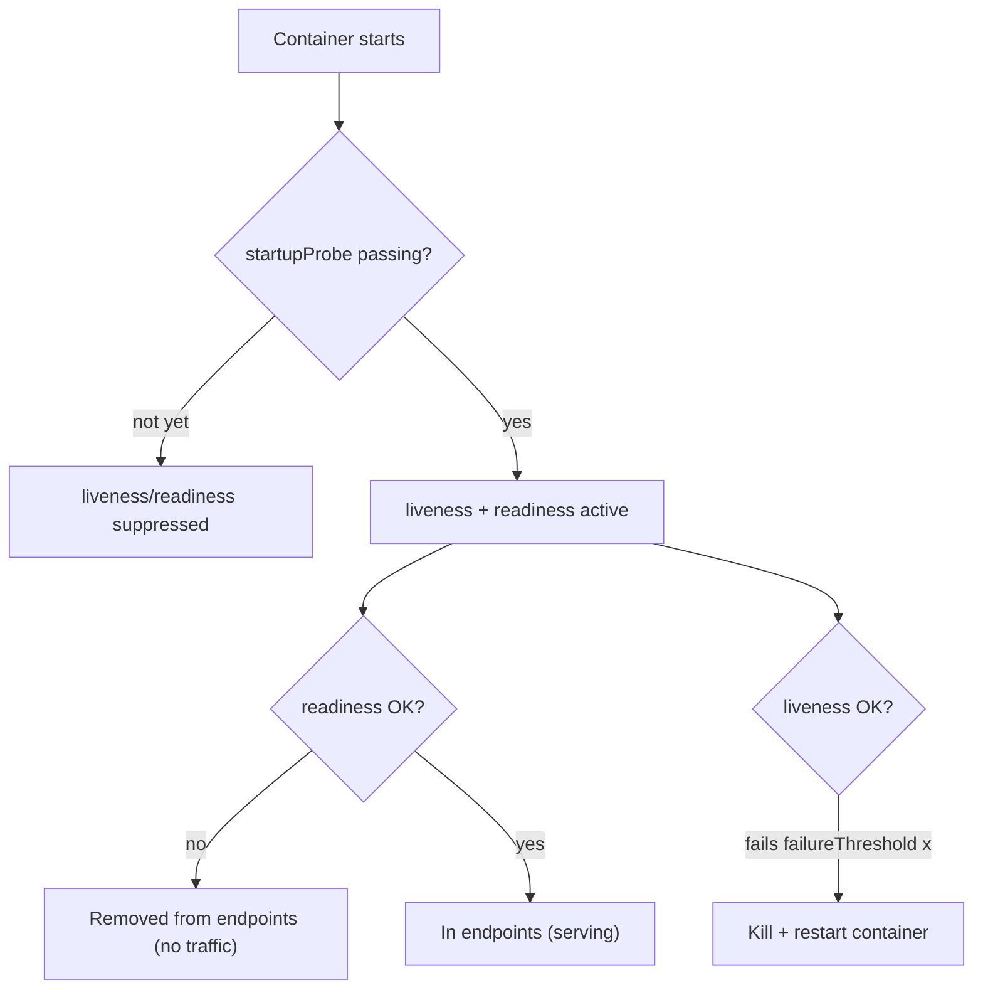

# Module 7 — Health, Resources & Scaling

## TL;DR

Three probes with distinct jobs: **liveness** restarts a wedged container, **readiness** gates traffic (in/out of endpoints), **startup** protects slow boots from liveness. **Requests** drive scheduling and define your **QoS class**; **limits** cap usage — exceeding a memory limit kills (OOMKilled), exceeding CPU only **throttles**. **HPA** scales replicas by a simple ratio formula; **PDB** protects availability during voluntary disruptions. Confusing liveness and readiness is the classic outage.

## Concept

Kubernetes must know: is this container alive? is it ready for traffic? how much CPU/memory may it use? Getting these three right is most of "production readiness".

## How It Really Works (Internals)

### The three probes

| Probe | Question | On failure | On success |
|-------|----------|-----------|-----------|
| **liveness** | Is the process wedged? | kubelet **kills + restarts** the container | keeps running |
| **readiness** | Can it serve now? | **removed from EndpointSlices** (no traffic) | added back to endpoints |
| **startup** | Has it finished booting? | kills if it never starts in time | **enables** liveness/readiness |

Probe tuning fields: `initialDelaySeconds`, `periodSeconds`, `timeoutSeconds`, `failureThreshold`, `successThreshold`. The kubelet runs each probe every `periodSeconds`; it acts only after `failureThreshold` consecutive failures.



**The classic mistake:** using one slow `/health` endpoint for both liveness and readiness on an app with a long warm-up. During boot, liveness fails before the app is up, the kubelet kills it, and it never starts → CrashLoopBackOff. Fix: a **startup probe** (or generous `initialDelaySeconds`) for boot, a cheap liveness check (process responds), and a readiness check that reflects real dependency health.

### Requests, limits, and what enforces them

```yaml
resources:
  requests: { cpu: 100m, memory: 128Mi }  # scheduling reservation
  limits:   { cpu: 500m, memory: 256Mi }  # hard cap
```

- **requests** = what the scheduler reserves on a node (bin-packing is based on requests, not usage). Also the baseline for HPA CPU%.
- **limits** = enforced by the kernel cgroup. **Memory over limit → OOMKilled** (container killed, restart counter increments). **CPU over limit → throttled** (CFS quota), never killed — the app just gets slower. This asymmetry is a top interview point.
- `cpu: 100m` = 0.1 of a core. Memory is bytes (`Mi`/`Gi`).

### QoS classes (drive eviction order)

| Class | Condition | Eviction priority |
|-------|-----------|-------------------|
| **Guaranteed** | every container has requests == limits (cpu & mem) | evicted **last** |
| **Burstable** | at least one request set, not all equal limits | middle |
| **BestEffort** | no requests/limits anywhere | evicted **first** under node pressure |

Under node memory pressure the kubelet evicts BestEffort first, then Burstable exceeding requests, protecting Guaranteed. Production-critical Pods should be Guaranteed (or Burstable with sane requests).

### HPA — the algorithm

The Horizontal Pod Autoscaler scales replicas to hit a target metric:

```
desiredReplicas = ceil( currentReplicas * ( currentMetricValue / desiredMetricValue ) )
```

Example: 4 replicas at 80% CPU, target 50% → `ceil(4 * 80/50) = ceil(6.4) = 7`. It reads metrics from the metrics API (metrics-server for CPU/mem, or custom/external adapters like Prometheus Adapter / KEDA). It needs **requests** defined to compute CPU **utilization %**. A **stabilization window** (default 5 min for scale-down) and configurable `behavior` policies damp flapping. With multiple metrics, HPA computes a desired replica count per metric and takes the **max**.

### PDB during voluntary disruption

A PodDisruptionBudget (`minAvailable` or `maxUnavailable`) blocks **voluntary** disruptions (node drain, cluster upgrade) that would violate it. `kubectl drain` calls the Eviction API, which respects PDBs; if evicting a Pod would drop below `minAvailable`, the eviction is refused and the drain blocks until another replica is Ready elsewhere. PDBs do **not** protect against involuntary disruptions (node crash, OOM).

## Why / When / Trade-offs

- **Set requests, be careful with limits:** missing requests breaks scheduling and HPA. CPU limits can cause surprising latency from throttling — many teams set CPU requests but omit CPU limits, while always setting memory requests **and** limits to avoid noisy-neighbor OOM of the node.
- **HPA vs VPA:** HPA changes replica count (good for stateless, scales out); VPA changes per-Pod requests/limits (good for right-sizing, but restarts Pods). Don't run both on CPU/mem for the same workload — they fight.
- **Guaranteed QoS** buys eviction safety at the cost of reserving peak resources continuously (lower bin-packing density).

## Worked Scenario

A rollout of a 3-replica API "hangs" and on-call sees elevated latency. Findings: the new version added a CPU `limit` of `200m` that's too low; under load the container is **CFS-throttled**, readiness probe `timeoutSeconds` is exceeded, so Pods flap out of endpoints — but they're never OOMKilled, so logs show no crash, just slowness. Simultaneously a PDB `minAvailable: 3` on a 3-replica Deployment means a concurrent node drain can't evict anything (it would drop below 3), blocking maintenance. Fixes: raise/remove the CPU limit, set readiness timeouts realistically, and set `minAvailable: 2` (or `maxUnavailable: 1`) so drains can proceed.

## Gotchas & Failure Modes

- **Liveness == readiness on a slow app** → CrashLoopBackOff; use a startup probe.
- **OOMKilled** (memory limit) vs **throttling** (CPU limit) — different symptoms, different fixes.
- **HPA without requests** → can't compute CPU% → no scaling.
- **PDB `minAvailable` == replica count** → drains block forever.
- **Aggressive `failureThreshold: 1`** → flaky restarts on transient blips.
- **HPA + VPA on same metric** → oscillation.
- **`kubectl top` empty** → metrics-server not installed/ready (see tooling note below).

## Interview Q&A

**Q: Difference between liveness and readiness probes?**
A: Liveness detects a wedged process and restarts the container. Readiness decides whether the Pod receives traffic by adding/removing it from Service endpoints. A failing readiness Pod keeps running but gets no traffic; a failing liveness Pod is killed and restarted.

**Q: What's the point of a startup probe?**
A: For slow-starting apps, it suppresses liveness/readiness until startup succeeds, so a long boot doesn't trip liveness and cause a restart loop. Once it passes, the normal probes take over.

**Q: What happens when a container exceeds its CPU limit versus its memory limit?**
A: Exceeding CPU is throttled by the kernel's CFS quota — the app slows down but isn't killed. Exceeding memory is fatal: the container is OOMKilled and restarted. That's why memory limits are about protection and CPU limits are about fairness/latency.

**Q: Derive the HPA target replica count.**
A: `desiredReplicas = ceil(currentReplicas * currentMetric / targetMetric)`. E.g. 4 replicas at 80% CPU with a 50% target → ceil(4*1.6) = 7. With multiple metrics it computes each and takes the max, and a stabilization window prevents flapping.

**Q: How do QoS classes affect eviction?**
A: Under node resource pressure the kubelet evicts BestEffort first, then Burstable over their requests, and Guaranteed last. Requests==limits for all containers yields Guaranteed; some requests yields Burstable; none yields BestEffort.

**Q: How does a PDB interact with `kubectl drain`?**
A: Drain uses the Eviction API which honors PDBs. If evicting a Pod would violate `minAvailable`/`maxUnavailable`, the eviction is rejected and the drain waits until a replacement is Ready. PDBs only cover voluntary disruptions, not crashes.

## Verify

```bash
kubectl apply -f labs/05-probes/
kubectl describe pod -l app=probed-app -n study        # probe config + events
kubectl get pod -l app=probed-app -n study -o jsonpath='{.items[*].status.qosClass}'
kubectl top pods -n study                              # needs metrics-server
kubectl get hpa -n study
kubectl get pdb -n study
kubectl get events -n study --field-selector reason=Killing
```

> Tooling note: `kubectl top` needs metrics-server. On kind, apply metrics-server and patch `--kubelet-insecure-tls`; on minikube, `minikube addons enable metrics-server`; on Rancher Desktop it's bundled with k3s. See Lab 00.

## Further Reading

- [Liveness, Readiness, Startup Probes](https://kubernetes.io/docs/tasks/configure-pod-container/configure-liveness-readiness-startup-probes/)
- [Resource Management / QoS](https://kubernetes.io/docs/concepts/configuration/manage-resources-containers/) · [Node-pressure Eviction](https://kubernetes.io/docs/concepts/scheduling-eviction/node-pressure-eviction/)
- [Horizontal Pod Autoscaling](https://kubernetes.io/docs/tasks/run-application/horizontal-pod-autoscale/) · [HPA walkthrough](https://kubernetes.io/docs/tasks/run-application/horizontal-pod-autoscale-walkthrough/)
- [Pod Disruption Budgets](https://kubernetes.io/docs/concepts/workloads/pods/disruptions/)
