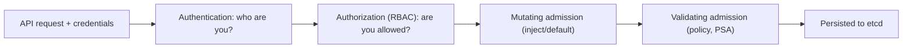

# Module 8 — Security

## TL;DR

Kubernetes security is **defense in depth** across four layers: **authn** (who are you), **authz/RBAC** (what may you do — allow-only, deny-by-default, no deny rules), **admission** (policy that mutates/validates objects before they persist), and **workload hardening** (securityContext, Pod Security Standards). Pods authenticate as **ServiceAccounts** using short-lived projected tokens. The senior instinct: minimize blast radius — least-privilege RBAC, default-deny NetworkPolicy, restricted Pod Security, and a hardened container.

## Concept

Every request to the API server is processed in a fixed order, and security controls map onto that pipeline:



## How It Really Works (Internals)

### Authentication

The API server supports multiple authenticators tried in turn: client certs, bearer tokens, OIDC (enterprise SSO), and ServiceAccount tokens. **Kubernetes has no user objects** — users are external identities (a cert CN, an OIDC claim). ServiceAccounts *are* first-class objects, used by in-cluster workloads.

### Authorization / RBAC (the core)

RBAC is **allow-only and deny-by-default**: nothing is permitted unless a Role grants it, and **there are no deny rules** — you can't subtract a permission, only avoid granting it.

| Object | Scope |
|--------|-------|
| **Role** | verbs on resources within one namespace |
| **ClusterRole** | cluster-wide, or cluster-scoped resources (nodes, PVs), or reusable across namespaces |
| **RoleBinding** | binds a Role (or ClusterRole) to subjects in one namespace |
| **ClusterRoleBinding** | binds a ClusterRole cluster-wide |

A rule is `apiGroups` + `resources` + `verbs` (get/list/watch/create/update/patch/delete). Authorization is the union of all bound roles. Subtle but important: a **ClusterRole bound by a RoleBinding** grants its permissions only within that one namespace — a common way to reuse a role definition with namespace scope.

### ServiceAccounts and bound tokens

Each Pod runs as a ServiceAccount (default: `default`). Modern clusters (1.22+) inject a **bound, projected token**: short-lived (default ~1h, auto-rotated), **audience-scoped**, and tied to the Pod's lifetime — far safer than the old never-expiring Secret tokens. Mounted at `/var/run/secrets/kubernetes.io/serviceaccount/`. Disable auto-mount (`automountServiceAccountToken: false`) for Pods that don't call the API.

### Admission control

After authz, admission webhooks run:

- **Mutating** (e.g. inject a sidecar, set defaults, add labels) — can change the object.
- **Validating** (e.g. enforce "no `:latest`", require resource limits) — can only accept/reject.

**Pod Security Admission (PSA)** is a built-in validating controller enforcing the **Pod Security Standards** via namespace labels:

| Level | Allows |
|-------|--------|
| **privileged** | anything (system workloads) |
| **baseline** | blocks known escalations (hostPath, privileged, hostNetwork, etc.) |
| **restricted** | hardened: non-root, drop ALL caps, seccomp, no privilege escalation |

Policy engines **OPA Gatekeeper** and **Kyverno** are validating/mutating webhooks for org-specific rules beyond PSA.

### Workload hardening (securityContext)

```yaml
securityContext:            # pod-level
  runAsNonRoot: true
  runAsUser: 1000
  fsGroup: 1000
  seccompProfile: { type: RuntimeDefault }
# container-level
  allowPrivilegeEscalation: false
  readOnlyRootFilesystem: true
  capabilities: { drop: ["ALL"] }
```

Plus supply-chain: scan images (Trivy/Grype), pin digests, use minimal/distroless bases, and `imagePullSecrets` for private registries.

## YAML Example

```yaml
apiVersion: v1
kind: ServiceAccount
metadata: { name: reader-sa, namespace: study }
---
apiVersion: rbac.authorization.k8s.io/v1
kind: Role
metadata: { name: pod-reader, namespace: study }
rules:
  - apiGroups: [""]
    resources: ["pods"]
    verbs: ["get", "list", "watch"]    # no create/delete = least privilege
---
apiVersion: rbac.authorization.k8s.io/v1
kind: RoleBinding
metadata: { name: read-pods, namespace: study }
subjects:
  - kind: ServiceAccount
    name: reader-sa
    namespace: study
roleRef:
  kind: Role
  name: pod-reader
  apiGroup: rbac.authorization.k8s.io
```

## Why / When / Trade-offs

- **Namespaced Role vs ClusterRole:** prefer namespaced Roles for app/team access (smaller blast radius). ClusterRoles for cluster resources or genuinely cross-namespace operators.
- **Dedicated SA per app vs default:** always create a per-app ServiceAccount with a minimal Role; the `default` SA often has surprising or future-granted permissions.
- **PSA `restricted` everywhere vs pragmatism:** aim for restricted; some legacy/system workloads need baseline/privileged in their own namespaces — isolate them rather than loosening globally.
- **Policy engine (OPA/Kyverno) vs PSA:** PSA covers Pod security levels; reach for Kyverno/Gatekeeper when you need richer rules (registry allowlists, required labels, image signature checks).

## Worked Scenario

A security review finds a microservice can read every Secret in its namespace because it uses the `default` ServiceAccount, which was bound to a broad ClusterRole "for convenience". Blast radius: a compromised Pod dumps all credentials. Remediation: create `app-sa`, bind a Role granting only the specific ConfigMaps/Secrets it needs (or none, via `automountServiceAccountToken: false` if it never calls the API), set the Deployment's `serviceAccountName: app-sa`, run the container `runAsNonRoot` with `readOnlyRootFilesystem` and dropped capabilities, and label the namespace `pod-security.kubernetes.io/enforce: restricted`. Verify with `kubectl auth can-i --list --as=system:serviceaccount:...`.

## Gotchas & Failure Modes

- **RBAC has no deny** — you can't carve out an exception by denying; restructure roles instead.
- **ClusterRole + RoleBinding** is namespace-scoped (catches people expecting cluster-wide).
- **`default` ServiceAccount** quietly used by Pods with no `serviceAccountName`.
- **`runAsNonRoot` with an image that only runs as root** → container won't start (intended, but surprising).
- **Secrets readable = compromised** — `get secrets` is high privilege; audit it.
- **PSA label typo** (`enforce` vs `warn`/`audit`) silently doesn't enforce.
- **Privileged/hostPath Pods** bypass most isolation — treat as break-glass.

## Interview Q&A

**Q: Explain the request pipeline and where security sits.**
A: Authentication identifies the caller; authorization (RBAC) checks if the action is allowed; mutating then validating admission can change or reject the object (including Pod Security Admission); only then is it persisted to etcd. Each stage is a distinct security control.

**Q: How does RBAC decide allow vs deny?**
A: It's allow-only and deny-by-default with no deny rules. The effective permission set is the union of all Roles/ClusterRoles bound to the subject; if nothing grants the verb/resource, it's denied. You never write a deny — you simply don't grant.

**Q: What's the difference between a Role and a ClusterRole, and what does a ClusterRole bound with a RoleBinding do?**
A: Role is namespaced; ClusterRole is cluster-scoped or reusable. Binding a ClusterRole with a RoleBinding applies its rules only inside that namespace — a way to reuse a role definition with namespace scope.

**Q: How do Pods authenticate to the API server today?**
A: Via their ServiceAccount's projected bound token — short-lived, audience-scoped, auto-rotated, tied to the Pod lifetime — mounted into the Pod. This replaced the old long-lived Secret-based tokens.

**Q: What are the Pod Security Standards and how are they enforced?**
A: Three levels — privileged, baseline, restricted — enforced by the built-in Pod Security Admission via namespace labels (`enforce`/`audit`/`warn`). Restricted requires non-root, dropped capabilities, seccomp, no privilege escalation. For richer policy you add Kyverno or OPA Gatekeeper.

**Q: Name the workload-hardening settings you'd put on a production container.**
A: `runAsNonRoot`/`runAsUser`, `readOnlyRootFilesystem: true`, `allowPrivilegeEscalation: false`, `capabilities: drop [ALL]`, `seccompProfile: RuntimeDefault`, a dedicated minimal-RBAC ServiceAccount, and a scanned, digest-pinned, distroless image.

## Verify

```bash
kubectl apply -f labs/06-rbac/
kubectl auth can-i list pods   --as=system:serviceaccount:study:reader-sa -n study   # yes
kubectl auth can-i delete pods --as=system:serviceaccount:study:reader-sa -n study   # no
kubectl auth can-i --list --as=system:serviceaccount:study:reader-sa -n study
kubectl get rolebinding,role,serviceaccount -n study
kubectl label ns study pod-security.kubernetes.io/enforce=restricted --overwrite
```

## Further Reading

- [RBAC](https://kubernetes.io/docs/reference/access-authn-authz/rbac/) · [Authentication](https://kubernetes.io/docs/reference/access-authn-authz/authentication/)
- [Admission Controllers](https://kubernetes.io/docs/reference/access-authn-authz/admission-controllers/) · [Pod Security Standards](https://kubernetes.io/docs/concepts/security/pod-security-standards/)
- [ServiceAccount tokens](https://kubernetes.io/docs/concepts/security/service-accounts/) · [Security Context](https://kubernetes.io/docs/tasks/configure-pod-container/security-context/)
- [Kyverno](https://kyverno.io/) · [OPA Gatekeeper](https://open-policy-agent.github.io/gatekeeper/)
