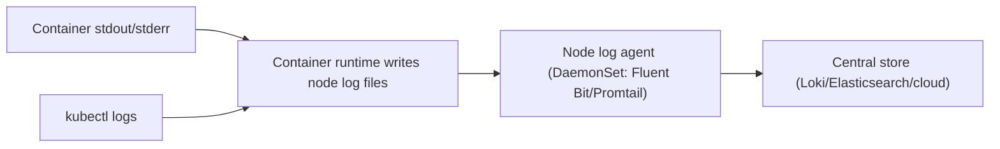
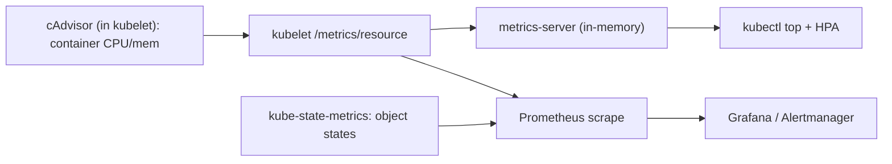
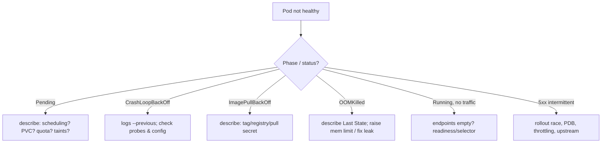

# Module 9 — Observability & Debugging

## TL;DR

Observability has three pillars — **logs, metrics, traces** — plus Kubernetes' own **events**. Logs flow from container stdout/stderr to node files to a cluster agent; metrics flow from cAdvisor → kubelet → metrics-server (for `kubectl top`/HPA) or Prometheus (for dashboards/alerts). Debugging is a disciplined funnel: **events → describe → logs (`--previous`) → exec/debug**. A senior can map a symptom (`Pending`, `CrashLoopBackOff`, `OOMKilled`, 503s) to a cause in seconds.

## Concept

You cannot operate what you cannot see. Kubernetes is observable through:

- **Events** — short-lived API objects describing what the control plane did (scheduling, pulls, kills).
- **Logs** — container stdout/stderr.
- **Metrics** — resource and app metrics.
- **Traces** — request flow across services (OpenTelemetry).

## How It Really Works (Internals)

### Logging architecture



Containers should log to **stdout/stderr**, not files. The runtime writes them to node files; `kubectl logs` reads those. **Node-local logs are lost when the Pod/node is gone** — that's why a DaemonSet log agent ships them centrally. `kubectl logs --previous` reads the *previous* container instance's logs, essential after a crash/restart.

### Metrics pipeline



- **cAdvisor** (embedded in kubelet) measures per-container CPU/memory.
- **metrics-server** aggregates these in memory for `kubectl top` and HPA — it is **not** a monitoring system (no history).
- **kube-state-metrics** exposes object-level state (deployments desired vs available, pod phase, restart counts).
- **Prometheus** scrapes all of the above plus app `/metrics`, stores time series, and powers Grafana/alerts.

### Method-driven analysis

- **RED** (for services): **R**ate, **E**rrors, **D**uration.
- **USE** (for resources): **U**tilization, **S**aturation, **E**rrors.

### Debugging decision tree



### `kubectl debug` and ephemeral containers

Distroless/minimal images have no shell, so `kubectl exec ... sh` fails. **Ephemeral containers** (`kubectl debug -it <pod> --image=busybox --target=<container>`) attach a temporary debug container sharing the target's namespaces — inspect processes, network, and files without rebuilding the image. `kubectl debug node/<node>` gives a privileged pod on a node.

## Symptom → cause table

| Symptom | Likely cause | First command |
|---------|--------------|---------------|
| `Pending` | No node fits (resources/taints), PVC unbound, quota | `kubectl describe pod` |
| `CrashLoopBackOff` | App error, bad config, probe too strict | `kubectl logs --previous` |
| `ImagePullBackOff` | Wrong tag, missing pull secret | `kubectl describe pod` |
| `OOMKilled` | Memory limit too low / leak | `kubectl describe pod` (Last State) |
| Running, not Ready | Readiness failing | `kubectl describe` + endpoints |
| Service unreachable | Empty endpoints, selector, NetworkPolicy | `kubectl get endpointslices` |
| Intermittent 503 | Rollout race, PDB, throttling | `kubectl rollout status` + events |

## Why / When / Trade-offs

- **metrics-server vs Prometheus:** metrics-server is required for HPA/`top` but keeps no history; Prometheus is for dashboards, alerting, and trend analysis. You typically run both.
- **Logs to stdout vs files:** stdout is the Kubernetes-native path (collected automatically); writing to files inside the container needs a sidecar to tail them and risks filling the writable layer.
- **Events are ephemeral** (~1h TTL) — for incident forensics you must ship them somewhere (event exporter) or they're gone.

## Worked Scenario

Users report intermittent 503s. Funnel: `kubectl get events --sort-by=.lastTimestamp` shows frequent `Killing`/`Unhealthy` around deploys. `kubectl get endpointslices` during a rollout shows endpoints briefly empty. `kubectl describe` reveals readiness `timeoutSeconds: 1` against an endpoint that does a DB call — under load it exceeds 1s, Pods drop out of endpoints, and with `maxUnavailable: 25%` too few remain to serve. Root cause: readiness probe too strict + rollout removing capacity faster than new Pods become Ready. Fix: lighten the readiness check (don't hit the DB), raise timeout, set `maxUnavailable: 0`/`maxSurge: 1`, add a `preStop` sleep. 503s clear.

## Gotchas & Failure Modes

- **Forgetting `--previous`** after a crash — you read the new container's empty logs and miss the error.
- **`kubectl top` empty** → metrics-server missing/not ready.
- **Events expire** — capture them during incidents.
- **No shell in distroless** — use `kubectl debug` ephemeral containers.
- **Logging to a file** instead of stdout — invisible to `kubectl logs` and the log agent.
- **describe shows the why** — most people jump to logs and miss scheduling/probe events in `describe`.

## Interview Q&A

**Q: A Pod is CrashLoopBackOff. Walk me through debugging.**
A: `kubectl describe pod` for events and Last State (exit code, OOM?), then `kubectl logs --previous` to see the crashed instance's output, then check the probe config (too-strict liveness?) and mounted config/secrets. CrashLoop is the kubelet backing off restarts of a container that keeps exiting.

**Q: What's the difference between metrics-server and Prometheus?**
A: metrics-server aggregates live CPU/memory from kubelets in memory to serve `kubectl top` and HPA — no history, not for alerting. Prometheus scrapes and stores time series (node, kube-state-metrics, app metrics) for dashboards, trends, and alerts. Different jobs; usually both run.

**Q: How do you debug a container built from a distroless image with no shell?**
A: `kubectl debug -it <pod> --image=busybox --target=<container>` attaches an ephemeral container sharing the target's namespaces, so I can inspect processes, network, and the filesystem without rebuilding the image.

**Q: Where do container logs go and why ship them off-node?**
A: stdout/stderr → runtime → node log files (what `kubectl logs` reads). Those are lost when the Pod/node is gone, so a DaemonSet agent (Fluent Bit/Promtail) ships them to central storage for retention and search.

**Q: A Service intermittently returns errors during deploys. Likely causes?**
A: Rollout removing Ready Pods faster than replacements come up (`maxUnavailable` too high), readiness probe flapping under load, the SIGTERM/endpoint-removal race without a `preStop`, or a PDB blocking proper draining. I'd correlate events with the rollout timeline and check endpoints during the deploy.

**Q: What are events and why are they unreliable for postmortems?**
A: Events are API objects the control plane emits (scheduled, pulled, killed). They have a short TTL (~1h) and aren't stored long-term, so unless you export them they're gone by the time you investigate later.

## Verify

```bash
kubectl get events -n study --sort-by='.lastTimestamp' | tail -20
kubectl describe pod <pod> -n study
kubectl logs <pod> -n study --previous -c <container>
kubectl logs -l app=web -n study --tail=50 -f
kubectl debug -it <pod> -n study --image=busybox:1.36 --target=<container>
kubectl top pods -n study     # metrics-server required (see Lab 00 per-tool setup)
```

## Further Reading

- [Logging Architecture](https://kubernetes.io/docs/concepts/cluster-administration/logging/)
- [Resource Metrics Pipeline](https://kubernetes.io/docs/tasks/debug/debug-cluster/resource-metrics-pipeline/)
- [Debug Running Pods / Ephemeral Containers](https://kubernetes.io/docs/tasks/debug/debug-application/debug-running-pod/)
- [kube-state-metrics](https://github.com/kubernetes/kube-state-metrics) · [Prometheus](https://prometheus.io/docs/introduction/overview/)
