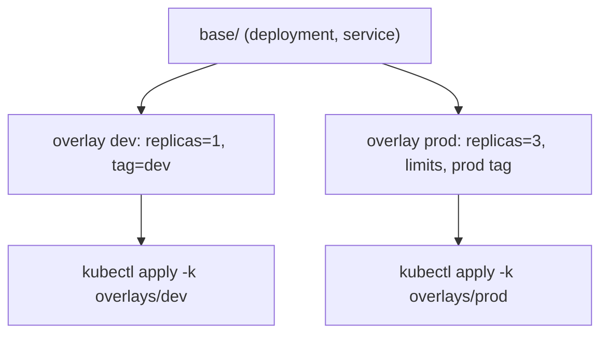
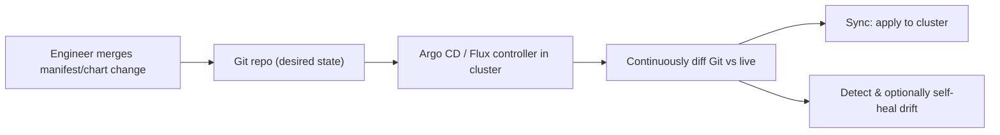

# Module 10 — Packaging & Delivery

## TL;DR

Production delivery is **declarative + Git as source of truth**. **Kustomize** layers plain YAML via bases/overlays and strategic-merge patches (no templating). **Helm** templates YAML from values and tracks releases (install/upgrade/rollback). **GitOps** (Argo CD/Flux) flips deployment to **pull**: a controller in the cluster continuously reconciles the cluster to Git, giving drift detection and audit. **Progressive delivery** (canary/blue-green) reduces blast radius beyond a plain rolling update.

## Concept

A senior owns the **deploy contract**: how manifests are structured, parameterized per environment, versioned, promoted, and rolled back — not just the Dockerfile.

| Approach | Mechanism | Best for |
|----------|-----------|----------|
| Imperative `kubectl run/scale` | Ad-hoc commands | Never in prod (not reproducible) |
| Declarative `kubectl apply -f` | YAML in Git | Baseline |
| **Kustomize** | Base + overlays + patches | Your own apps, multi-env without templating |
| **Helm** | Go-templated charts + values + releases | Packaging/distribution, third-party apps |
| **GitOps** | Controller reconciles cluster→Git | Auditable, drift-resistant continuous delivery |

## How It Really Works (Internals)

### Kustomize (overlay/patch model)

Kustomize does **no templating** — it transforms YAML. A `base/` holds common manifests; `overlays/dev|prod/` reference the base and apply **strategic-merge or JSON6902 patches**, `namePrefix`, `commonLabels`, `replicas`, `images`, and generators (`configMapGenerator` adds a content hash to the name, forcing a rollout on change). Built into `kubectl` (`kubectl apply -k`). The win: environments differ by *diff*, not by duplicated files or template logic.



### Helm (templating + release lifecycle)

A **chart** is templated YAML (`templates/*.yaml` with Go templating) + a `values.yaml` of defaults. `helm install` renders templates with merged values and records a **release** (revision history stored as Secrets in-cluster). `helm upgrade` renders the new revision and diffs; `helm rollback` re-applies a prior revision. Strength: parameterization and distribution (one chart, many installs). Cost: template complexity and the "it rendered wrong" debugging that comes with logic in YAML.

### GitOps (pull-based)



Instead of CI pushing with `kubectl apply` (push model, needs cluster creds in CI), a **controller inside the cluster pulls** from Git and reconciles. Benefits: Git is the audit log, drift (manual `kubectl edit`) is detected and can be auto-reverted, and cluster credentials never leave the cluster. Argo CD adds a UI and app-of-apps; Flux is CNCF and composes with Helm/Kustomize.

### Progressive delivery

- **Rolling update** (built-in): gradually replace Pods (Module 3) — simple, but the new version takes real traffic immediately as Pods become Ready.
- **Blue-green**: run v2 alongside v1, switch the Service/Ingress all at once; instant rollback by switching back. Doubles resources during the cutover.
- **Canary**: send a small % of traffic to v2, watch metrics, ramp up. Needs traffic-splitting (Ingress/Gateway/mesh) and analysis (Argo Rollouts, Flagger).

## YAML Example (Kustomize overlay)

```yaml
# overlays/prod/kustomization.yaml
apiVersion: kustomize.config.k8s.io/v1beta1
kind: Kustomization
resources: [../../base]
namePrefix: prod-
commonLabels: { environment: production }
replicas:
  - { name: web, count: 3 }
images:
  - { name: nginx, newTag: 1.25-alpine }
patches:
  - target: { kind: Deployment, name: web }
    patch: |
      - op: add
        path: /spec/template/spec/containers/0/resources/limits
        value: { memory: 128Mi }
```

## Why / When / Trade-offs

- **Kustomize vs Helm:** Kustomize for your own apps where you want plain, readable YAML and env diffs; Helm for packaging/distributing software and heavy parameterization. Many teams use **both** — Helm for third-party, Kustomize for in-house (or Kustomize to patch a rendered Helm chart).
- **Push vs pull (GitOps):** push (CI applies) is simple to start but spreads cluster creds and has no drift detection; pull (GitOps) centralizes reconciliation and audit at the cost of running and learning Argo/Flux.
- **Canary vs blue-green vs rolling:** rolling is free but blunt; blue-green gives instant rollback at 2x cost; canary gives metric-gated safety but needs traffic-splitting infrastructure.

## Worked Scenario

A team deploys via a CI pipeline that runs `kubectl apply` with a long-lived kubeconfig stored as a CI secret. Problems: anyone with CI access can reach prod, manual hotfixes (`kubectl edit`) silently drift from Git, and there's no single audit trail. Move to **GitOps**: install Argo CD, point it at the manifests repo, and let it reconcile. Now merges to `main` are the only path to prod (PR review = change control), drift is flagged and auto-healed, CI no longer holds cluster creds, and rollback is `git revert`. For risky changes they add **Argo Rollouts** canary with automated metric analysis.

## Gotchas & Failure Modes

- **`:latest` / unpinned tags** — non-reproducible deploys; a node re-pull can change the running code. Pin tags or digests.
- **Helm template logic gone wrong** — render locally (`helm template`) and diff before applying.
- **Drift in push model** — manual edits diverge from Git with no detection.
- **ConfigMap change without rollout** — use Kustomize `configMapGenerator` (hashed names) or a checksum annotation (Module 5).
- **GitOps + manual edits fight** — if auto-sync/self-heal is on, your `kubectl edit` is reverted (by design).
- **Secrets in Git** — never plaintext; use Sealed Secrets/ESO (Module 5).

## Interview Q&A

**Q: Kustomize vs Helm — when each?**
A: Kustomize transforms plain YAML via bases/overlays/patches with no templating — great for in-house apps and per-env differences you want to read as diffs. Helm templates YAML from values and manages release revisions with rollback — great for packaging/distributing software and heavy parameterization. They're often combined.

**Q: What is GitOps and what does it buy you over `kubectl apply` in CI?**
A: GitOps puts a controller inside the cluster that continuously reconciles live state to a Git repo (pull model). Versus CI push, you get drift detection/self-healing, Git as a complete audit trail, change control via PRs, and no cluster credentials living in CI.

**Q: Contrast canary and blue-green deployments.**
A: Blue-green runs the new version in parallel and switches all traffic at once (instant rollback, ~2x resources during cutover). Canary shifts a small traffic percentage to the new version, validates metrics, and ramps gradually — safer for catching regressions but needs traffic-splitting and analysis tooling.

**Q: How do you guarantee a config change actually rolls out?**
A: Pod templates only roll when they change, so I make config changes change the template: Kustomize's `configMapGenerator` appends a content hash to the ConfigMap name (new name → template change → rollout), or a `checksum/config` annotation does the same.

**Q: How do you do an instant rollback?**
A: With Deployments, `kubectl rollout undo` scales the previous ReplicaSet back up. With Helm, `helm rollback` to a prior revision. With GitOps, `git revert` and let the controller reconcile. Blue-green gives the fastest cutover by switching the Service back to the old version.

## Verify

```bash
kubectl kustomize labs/08-packaging/overlays/prod      # render without applying
kubectl apply -k labs/08-packaging/overlays/dev
kubectl diff -k labs/08-packaging/overlays/prod        # preview changes
kubectl rollout undo deployment/dev-web -n study
# helm template ./chart -f values-prod.yaml            # render a chart locally
```

## Further Reading

- [Declarative Management with Kustomize](https://kubernetes.io/docs/tasks/manage-kubernetes-objects/kustomization/) · [Kustomize](https://kustomize.io/)
- [Helm](https://helm.sh/docs/) · [Argo CD](https://argo-cd.readthedocs.io/) · [Flux](https://fluxcd.io/)
- [Argo Rollouts (progressive delivery)](https://argo-rollouts.readthedocs.io/) · [Flagger](https://flagger.app/)
