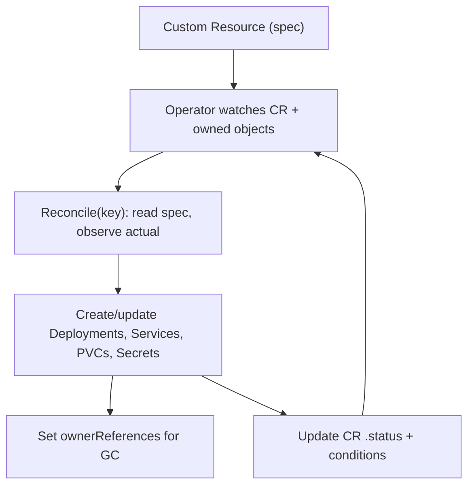

# Module 11 — Operators & CRDs

## TL;DR

Kubernetes is extensible: a **CustomResourceDefinition (CRD)** adds a new object type to the API, and an **operator** is a custom controller that reconciles that type — encoding human operational knowledge (backup, failover, upgrades) into software. Operators follow the same reconcile-loop pattern as built-in controllers (watch → diff → act → update status). The senior judgment is **when not to build one**: a Deployment + Helm chart is often enough.

## Concept

Two extension mechanisms matter here:

- **CRD** — register a new `kind` (e.g. `kind: Database`) with the API server. Users then `kubectl apply` instances of it like any native object, with validation, RBAC, and `kubectl get` support.
- **Operator** — a controller watching that custom resource and driving real-world state to match its spec.

This is the **operator pattern**: "a custom controller + a custom resource that automates a specific application's lifecycle."

## How It Really Works (Internals)

### CRDs

A CRD defines `group/version/kind`, scope (Namespaced/Cluster), and an **OpenAPI v3 schema** that the API server uses to validate instances. Once applied, the API server serves a new REST endpoint for that kind — it's stored in etcd and behaves like a first-class object.

- **Versioning & conversion:** a CRD can serve multiple versions (`v1alpha1`, `v1beta1`, `v1`) with one marked `storage: true`. To evolve schemas you provide a **conversion webhook** that translates between versions on read/write — this is how operators upgrade their API without breaking existing objects.
- **Subresources:** enabling the `/status` subresource separates **spec** (user intent) from **status** (controller-reported state), so the controller updates status without fighting user spec edits (and RBAC can be split). A `/scale` subresource lets HPA target a custom resource.
- **Printer columns & categories** improve `kubectl get` UX.

### The operator reconcile loop



Built with **controller-runtime / Kubebuilder** (Go) or **Operator SDK** (also Ansible/Helm-based), or **Kopf** (Python). Key practices mirror Module 1: idempotent reconcile, set `ownerReferences` so children are garbage-collected with the CR, use **finalizers** for external cleanup (deprovision a cloud DB before the CR is deleted), and record progress in `status.conditions`.

### Maturity levels

Operators range from "install" (just deploys) to "seamless upgrades, backups, auto-tuning" (the Operator Capability Levels). A mature DB operator handles failover, scaling, backup/restore, and version upgrades automatically.

## YAML Example

```yaml
# 1) Define a new kind
apiVersion: apiextensions.k8s.io/v1
kind: CustomResourceDefinition
metadata: { name: caches.example.com }
spec:
  group: example.com
  scope: Namespaced
  names: { kind: Cache, plural: caches, singular: cache, shortNames: [ca] }
  versions:
    - name: v1
      served: true
      storage: true
      subresources: { status: {} }
      schema:
        openAPIV3Schema:
          type: object
          properties:
            spec:
              type: object
              properties:
                size: { type: integer, minimum: 1, maximum: 9 }
            status:
              type: object
              properties:
                readyReplicas: { type: integer }
---
# 2) A user creates an instance; the operator reconciles it
apiVersion: example.com/v1
kind: Cache
metadata: { name: sessions, namespace: study }
spec: { size: 3 }
```

## Why / When / Trade-offs

- **Build vs buy:** use a mature community operator for standard software (Postgres via CloudNativePG/Zalando, Kafka via Strimzi, cert-manager for certificates). Build one only for genuinely bespoke in-house systems where the operational logic is worth maintaining in Go.
- **Operator vs Helm chart:** Helm installs and templates static manifests; it has **no runtime intelligence**. An operator continuously reconciles and reacts to failures/drift. If your app is just "deploy these manifests," a chart is simpler and cheaper to own.
- **CRD vs ConfigMap:** a CRD gives schema validation, RBAC, `kubectl` integration, and watch semantics — far better than stuffing config into a ConfigMap and writing a bespoke watcher.
- **Cost:** operators are long-lived code you must maintain, test against new Kubernetes versions, and secure (they often need broad RBAC).

## Worked Scenario

A team needs self-healing Redis with automatic failover and scheduled backups. Option A: a Helm chart that deploys a StatefulSet — but it can't promote a replica on primary failure or run backups; humans do that at 3am. Option B: adopt a **Redis operator**. Now a `Redis` CR with `spec.size` and `spec.backupSchedule` drives the whole lifecycle: the operator watches health, promotes on failover, runs backup CronJobs, and reports `status.conditions`. They didn't build it — they bought (adopted) a mature one, getting the operational knowledge for free. They review its RBAC (cluster-wide, broad) and isolate it appropriately.

## Gotchas & Failure Modes

- **CRD schema too loose** — without validation, bad specs reach the controller and fail confusingly; define OpenAPI constraints.
- **Forgot ownerReferences** — deleting the CR orphans its Deployments/PVCs (no cascading GC).
- **Stuck finalizer** — operator down/broken leaves CRs un-deletable (same pattern as Module 1).
- **Spec/status not separated** — controller and user updates collide; enable the `/status` subresource.
- **Version upgrades without a conversion webhook** — break existing custom resources.
- **Over-broad operator RBAC** — a compromised operator is high blast radius; scope it.

## Interview Q&A

**Q: What is the operator pattern?**
A: A custom controller plus a custom resource that together automate an application's operational lifecycle. The CRD adds a new API type; the operator watches it and reconciles real resources (Deployments, PVCs, backups, failover) to match the resource's spec — encoding what an experienced operator would do by hand.

**Q: CRD vs ConfigMap for extending behavior?**
A: A CRD is a first-class API type with schema validation, RBAC, `kubectl` support, status subresource, and watch semantics. A ConfigMap is opaque data with none of that. If you're building automation around a new concept, a CRD is the right primitive.

**Q: When would you NOT build an operator?**
A: When the app is just "apply these manifests" with no runtime decisions — a Helm chart or Kustomize is simpler and cheaper. Also when a mature community operator already exists; adopt it rather than maintaining bespoke controller code.

**Q: How does an operator clean up external resources on delete?**
A: With a finalizer. The operator adds a finalizer to the CR; on delete, `deletionTimestamp` is set but the object lingers while the operator deprovisions external state (e.g. a cloud database), then removes the finalizer so the API server can complete deletion.

**Q: What does the status subresource give you?**
A: It separates user-owned `spec` from controller-owned `status`, so the operator can report observed state/conditions without conflicting with user edits, and RBAC can grant status updates independently. It also enables proper optimistic concurrency on each.

**Q: How do operators handle API schema evolution?**
A: A CRD serves multiple versions with one as storage version and a conversion webhook translating between them, so older custom resources keep working while the schema evolves toward the new version.

## Verify

```bash
kubectl get crd                                  # registered custom types
kubectl api-resources --api-group=example.com    # your CRD's resources
kubectl explain cache.spec                        # schema-driven docs
kubectl get cache -n study -o wide
# If cert-manager is installed (a real-world operator/CRD example):
kubectl get certificates,issuers -A
```

## Further Reading

- [Custom Resources](https://kubernetes.io/docs/concepts/extend-kubernetes/api-extension/custom-resources/) · [CRD versioning](https://kubernetes.io/docs/tasks/extend-kubernetes/custom-resources/custom-resource-definition-versioning/)
- [Operator Pattern](https://kubernetes.io/docs/concepts/extend-kubernetes/operator/)
- [Kubebuilder Book](https://book.kubebuilder.io/) · [Operator SDK](https://sdk.operatorframework.io/)
