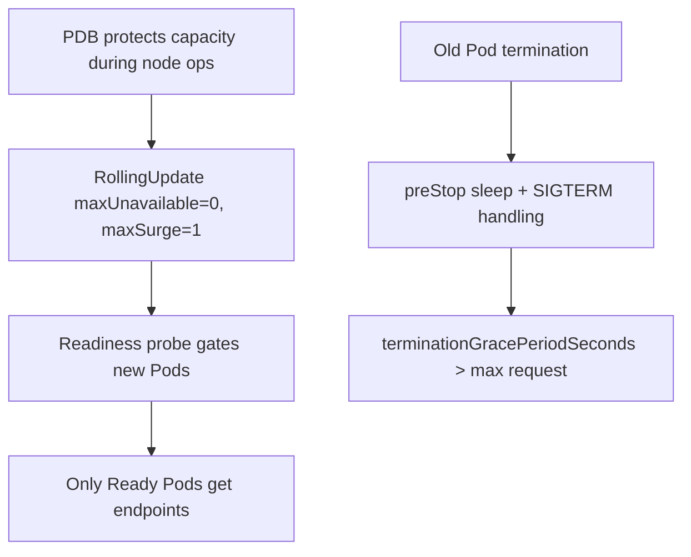

# Module 12 — Production Patterns & Pitfalls

## TL;DR

Production Kubernetes is the disciplined application of everything prior: **stateless 12-factor apps**, **graceful shutdown**, **right-sized requests/limits with probes and PDBs**, **least-privilege security**, and a clear **multi-environment / blast-radius** strategy. Most outages trace to a short list of anti-patterns — floating tags, missing probes, no resource limits, one giant namespace. A senior designs for **zero-downtime deploys** and **bounded failure domains** by default.

## Concept

This module ties the threads together into operational judgment: how to run reliably, contain failure, control cost, and answer the senior interview's scenario questions.

## How It Really Works (Internals)

### 12-factor mapped to Kubernetes

| Factor | Kubernetes mechanism |
|--------|----------------------|
| Config | ConfigMap/Secret, not baked images (M5) |
| Backing services | Service DNS / external endpoints |
| Processes (stateless) | Deployment; state in PVC/DB (M3/M6) |
| Concurrency | replicas + HPA (M7) |
| Disposability | fast start, graceful SIGTERM (M2) |
| Dev/prod parity | same manifests, Kustomize overlays (M10) |
| Logs | stdout → agent (M9) |
| Admin processes | Jobs, not SSH (M3) |

### Zero-downtime deployment (the composite skill)

Achieving it requires several mechanisms together:



A new version takes traffic only when **Ready**; old Pods drain in-flight requests via `preStop` + SIGTERM handling; capacity never dips below desired (`maxUnavailable: 0`); and a PDB keeps node maintenance from dropping you below a safe count.

### Multi-environment & blast radius

| Strategy | Isolation | Cost/Ops |
|----------|-----------|----------|
| Namespaces per env (one cluster) | Weak (shared control plane/nodes) | Cheap |
| Cluster per env | Strong | Higher |
| Cluster per tenant/prod-region | Strongest | Highest |

Common pattern: **separate cluster for prod**, namespaces for dev/staging. Within a cluster, contain blast radius with **ResourceQuota/LimitRange** per namespace, NetworkPolicy default-deny, and per-team RBAC.

### Capacity & cost

Requests drive bin-packing and cost. Over-requesting wastes money (low density); under-requesting risks eviction/throttling. Use VPA recommendations or historical metrics to right-size, Cluster Autoscaler to match node count to demand, and `PriorityClass` so critical Pods preempt best-effort ones under pressure (Module 13/15).

## Why / When / Trade-offs

- **Namespace vs cluster isolation:** namespaces are cheap but share a control plane and kernel — a noisy or compromised tenant can affect others. Separate clusters cost more but bound failure and security domains. Choose per the cost of cross-tenant impact.
- **Density vs safety:** tighter requests pack more Pods per node (cheaper) but raise eviction/throttle risk; Guaranteed QoS for critical workloads trades density for stability.
- **Self-healing GitOps vs manual control:** auto-sync prevents drift but forbids quick manual fixes; some teams keep prod on manual sync for break-glass.

## Worked Scenario

A startup runs everything — dev, staging, prod — in one namespace on one cluster with `:latest` images, no resource limits, and no probes. Incidents: a dev workload OOMs a node and evicts prod Pods (no limits, no QoS separation); a bad `:latest` push silently rolls out and can't be rolled back to a known version; a missing readiness probe sends traffic to a booting Pod (502s). The senior remediation: split prod into its own cluster (or at least namespaces with ResourceQuota + NetworkPolicy default-deny), pin image tags/digests, add requests/limits (Guaranteed for prod-critical), add readiness/liveness/startup probes, add PDBs, and move deploys to GitOps with `git revert` rollback. Each fix maps to a prior module.

## Anti-pattern checklist

| Anti-pattern | Consequence | Fix |
|--------------|-------------|-----|
| `image: app:latest` | Non-reproducible, no rollback | Pin tag/digest |
| No requests/limits | Bad scheduling, noisy-neighbor, node OOM | Set both; Guaranteed for critical |
| Missing readiness probe | Traffic to unready Pods → 5xx | Add readiness |
| liveness == readiness | Restart loops on slow start | Add startup probe |
| One giant namespace | No RBAC/quota/policy scoping | Namespace per team/env |
| Secrets in Git plaintext | Credential leak | Sealed Secrets / ESO |
| Relying on Pod IP | Breaks on reschedule | Service DNS |
| No PDB | Outage during node drains | Define PDB |
| No graceful shutdown | Dropped requests on deploy | preStop + SIGTERM handling |

## Senior Interview Checklist

You should be able to speak fluently to:

- Reconciliation loop and a controller you know end-to-end.
- Deployment vs StatefulSet vs DaemonSet selection.
- liveness vs readiness vs startup; QoS and eviction.
- How a Service routes to Pods; empty-endpoints debugging.
- RBAC least privilege; Pod Security Standards.
- Zero-downtime deploy design (the composite above).
- Debugging Pending / CrashLoopBackOff / OOMKilled / 503.
- GitOps vs push; canary vs blue-green.
- Scheduling: affinity, taints, topology spread (Module 13).
- Control-plane internals: etcd/Raft, informers, finalizers (Module 14).

## Gotchas & Failure Modes

- **"Works in dev" but prod differs** — config baked in images or drift between manually-edited environments; enforce overlays + GitOps.
- **No capacity headroom** — rollouts can't surge, HPA can't scale, Cluster Autoscaler lags; plan buffer.
- **Quota exhaustion** — ResourceQuota blocks new Pods silently; watch `kubectl describe quota`.
- **Cross-namespace reachability** — without NetworkPolicy, "isolated" namespaces aren't.
- **Stuck namespace deletion** — finalizers (Module 1).

## Interview Q&A

**Q: How do you design a zero-downtime deployment?**
A: Rolling update with `maxUnavailable: 0`/`maxSurge: 1` so new Ready Pods are added before old ones leave; readiness probes so traffic only hits Ready Pods; `preStop` sleep plus SIGTERM handling to drain in-flight requests; `terminationGracePeriodSeconds` above the longest request; and a PDB so node maintenance can't drop below safe capacity. For extra safety, canary with metric analysis.

**Q: How do you isolate environments and bound blast radius?**
A: Separate prod into its own cluster where the cost of cross-impact is high; otherwise namespaces with ResourceQuota/LimitRange, default-deny NetworkPolicy, and per-team RBAC. The goal is that a failure or compromise in one scope can't cascade.

**Q: What are the most common production anti-patterns you look for in review?**
A: Floating `:latest` tags, missing resource requests/limits, missing or misconfigured probes (liveness==readiness), no PDB, no graceful shutdown, secrets in Git, and a single catch-all namespace. Each has a direct, known fix.

**Q: How do you right-size and control cost?**
A: Set requests from real usage (VPA recommendations or historical metrics), pack with appropriate QoS, scale Pods with HPA and nodes with Cluster Autoscaler, and use PriorityClasses so critical workloads preempt low-priority ones under pressure. Over-requesting wastes money; under-requesting risks eviction.

**Q: A change works in staging but breaks in prod. How do you prevent that class of bug?**
A: Eliminate environment drift: same base manifests with Kustomize overlays for the only intended differences, config externalized (not baked), images pinned by digest, and GitOps so both environments reconcile from Git with no untracked manual edits.

## Verify

```bash
kubectl get resourcequota,limitrange -n study
kubectl get pdb -n study
kubectl get pods -n study -o jsonpath='{range .items[*]}{.metadata.name}{" qos="}{.status.qosClass}{"\n"}{end}'
kubectl get deploy -n study -o jsonpath='{range .items[*]}{.metadata.name}{": "}{.spec.template.spec.containers[0].image}{"\n"}{end}'  # check for :latest
kubectl get networkpolicy -n study
```

## Further Reading

- [The Twelve-Factor App](https://12factor.net/)
- [Configuration Best Practices](https://kubernetes.io/docs/concepts/configuration/overview/)
- [Pod Disruptions](https://kubernetes.io/docs/concepts/workloads/pods/disruptions/) · [Resource Quotas](https://kubernetes.io/docs/concepts/policy/resource-quotas/)
- [Production environment](https://kubernetes.io/docs/setup/production-environment/)
