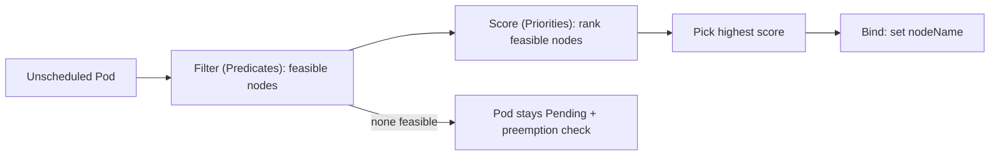

# Module 13 — Scheduling & Placement

## TL;DR

The scheduler binds each unscheduled Pod to a node in two phases: **filter** (which nodes are feasible) then **score** (which feasible node is best). You influence it with **nodeSelector** (hard, simple), **node affinity** (hard/soft, expressive), **pod (anti-)affinity** (co-locate/spread relative to other Pods), **taints/tolerations** (nodes repel Pods unless tolerated), and **topology spread constraints** (even distribution across zones/nodes). **PriorityClass** lets important Pods **preempt** lower-priority ones. Getting placement right is how you achieve HA, isolation, and efficient packing.

## Concept

A Pod with no `nodeName` is "unscheduled". kube-scheduler watches for these and assigns each to a node. It's a per-Pod decision, fast and pluggable (the scheduling framework).



## How It Really Works (Internals)

### Filter then score

- **Filter** removes infeasible nodes: insufficient allocatable CPU/mem (based on **requests**), unsatisfied nodeSelector/affinity, untolerated taints, volume/zone topology mismatch, node not Ready.
- **Score** ranks the survivors: spread, least/most allocated, affinity preferences, image locality, topology spread, etc. Highest score wins; ties broken randomly.
- If **no node passes filter**, the Pod stays `Pending` and (if it has priority) **preemption** may evict lower-priority Pods to make room.

### nodeSelector vs node affinity

- **nodeSelector** — simplest: Pod runs only on nodes with matching labels. Hard requirement, equality only.
- **node affinity** — richer matching with operators (In/NotIn/Exists/Gt/Lt) and two flavors:
  - `requiredDuringSchedulingIgnoredDuringExecution` — hard (must match to schedule).
  - `preferredDuringSchedulingIgnoredDuringExecution` — soft (weighted preference). "IgnoredDuringExecution" means it's only checked at scheduling time, not enforced after.

### Pod affinity / anti-affinity

Place a Pod relative to **other Pods** (by label) within a **topologyKey** domain (e.g. `kubernetes.io/hostname`, `topology.kubernetes.io/zone`):

- **Pod affinity** — co-locate (e.g. cache near the app for latency).
- **Pod anti-affinity** — spread (e.g. don't put two replicas of the same app on one node → survive a node failure).

These are powerful but **expensive at scale** (the scheduler evaluates cross-Pod relationships); prefer topology spread constraints for simple spreading.

### Taints and tolerations

- A **taint** on a node repels Pods: `key=value:Effect` where Effect is `NoSchedule` (don't place), `PreferNoSchedule` (avoid), or `NoExecute` (evict running Pods that don't tolerate).
- A **toleration** on a Pod allows (but does not require) it onto a tainted node.
- Used for **dedicated nodes** (GPU, build agents), keeping general workloads off special hardware, and node lifecycle (the node controller taints unreachable nodes `NoExecute` to evict Pods).

### Topology spread constraints

The modern, scalable way to spread Pods evenly across failure domains:

```yaml
topologySpreadConstraints:
  - maxSkew: 1
    topologyKey: topology.kubernetes.io/zone
    whenUnsatisfiable: DoNotSchedule   # or ScheduleAnyway (soft)
    labelSelector:
      matchLabels: { app: web }
```

`maxSkew` bounds the difference in Pod count between the most and least populated domains. This gives HA across zones/nodes more cheaply and declaratively than pod anti-affinity.

### Priority and preemption

A **PriorityClass** assigns an integer priority. Higher-priority Pending Pods can **preempt** (evict) lower-priority running Pods if that's the only way to schedule them. Used to guarantee critical workloads get capacity under pressure. `preemptionPolicy: Never` makes a high-priority Pod that won't preempt.

### Scheduling gates

`schedulingGates` (1.27+) hold a Pod as unschedulable until an external controller removes the gate — useful for quota/sequencing/just-in-time setups before the scheduler considers it.

## Why / When / Trade-offs

- **Topology spread vs pod anti-affinity:** both achieve spreading; topology spread is cheaper and more declarative (`maxSkew`), anti-affinity is more flexible but heavier on the scheduler. Prefer topology spread for plain HA.
- **Hard vs soft (required vs preferred):** hard rules can leave Pods `Pending` if unsatisfiable; soft rules degrade gracefully. Use hard only when the constraint is truly mandatory (e.g. GPU).
- **Taints (repel) vs node affinity (attract):** taints keep *other* Pods off special nodes; node affinity pulls *your* Pod toward labeled nodes. For dedicated hardware you often use **both** (taint the node, and add affinity + toleration to the intended Pods).

## Worked Scenario

A 6-replica web app keeps going fully down when a single node or zone fails — all replicas happened to pack onto one node/zone. Fix with **topology spread** across zones (`maxSkew: 1`, `topologyKey: topology.kubernetes.io/zone`) plus across nodes (`topologyKey: kubernetes.io/hostname`), so replicas are forced apart. For a latency-sensitive cache, add **pod affinity** to co-locate cache Pods with the app in the same zone. GPU training Pods are kept off general nodes by **tainting** GPU nodes `nvidia.com/gpu=true:NoSchedule` and giving only training Pods the matching toleration + node affinity. Critical control Pods get a high **PriorityClass** so they preempt batch jobs under pressure.

## Gotchas & Failure Modes

- **Pod Pending, "0/N nodes available"** — read the scheduler message in `kubectl describe pod`: it lists why each node was filtered (insufficient cpu, untolerated taint, didn't match affinity, volume zone).
- **Over-constrained affinity** → unschedulable Pods (no feasible node).
- **`IgnoredDuringExecution`** — affinity isn't re-evaluated after scheduling; a node relabeled later won't evict the Pod.
- **Pod anti-affinity at scale** — slows scheduling significantly; use topology spread.
- **Forgetting tolerations** — control-plane/specialized nodes taint by default; DaemonSets often must tolerate everything.
- **`maxSkew` too strict + too few nodes** → `DoNotSchedule` leaves Pods Pending.

## Interview Q&A

**Q: Describe how the scheduler picks a node.**
A: Two phases. Filter eliminates infeasible nodes — insufficient requested resources, unmet nodeSelector/affinity, untolerated taints, topology/volume mismatch. Score ranks the feasible nodes (spread, allocation balance, affinity preferences, etc.) and binds the Pod to the highest scorer. If none are feasible, the Pod stays Pending and may trigger preemption.

**Q: nodeSelector vs node affinity vs pod affinity?**
A: nodeSelector is a simple hard label match on nodes. Node affinity is richer (operators, required vs preferred) but still about node labels. Pod affinity/anti-affinity places a Pod relative to *other Pods* within a topology domain — co-locate or spread.

**Q: How do taints and tolerations work, and how do they differ from affinity?**
A: Taints repel Pods from a node unless the Pod has a matching toleration; affinity attracts a Pod toward nodes. Taints are node-side "keep out"; affinity is Pod-side "I want to be there". For dedicated hardware you taint the node and add toleration + affinity to the intended Pods so only they land there.

**Q: How do you ensure replicas survive a zone failure?**
A: Topology spread constraints with `topologyKey: topology.kubernetes.io/zone` and `maxSkew: 1` force even distribution across zones (and another constraint across hostnames for node-level spread). It's cheaper and clearer than pod anti-affinity.

**Q: What is preemption?**
A: When a high-PriorityClass Pod can't schedule, the scheduler may evict lower-priority Pods on a node to free room, then schedule the important Pod. It guarantees critical workloads get capacity under contention.

**Q: A Pod is Pending. How do you find out why?**
A: `kubectl describe pod` — the scheduler records a FailedScheduling event explaining per-node rejections (insufficient cpu/memory, taints not tolerated, affinity not matched, volume zone conflict). That message points straight at the constraint to relax or the capacity to add.

## Verify

```bash
kubectl describe pod <pending-pod> -n study | sed -n '/Events/,$p'   # FailedScheduling reasons
kubectl get nodes --show-labels
kubectl taint nodes <node> dedicated=gpu:NoSchedule        # add a taint (then schedule a tolerating pod)
kubectl get pods -n study -o wide                          # see node placement / spread
kubectl get priorityclasses
```

## Further Reading

- [Kubernetes Scheduler](https://kubernetes.io/docs/concepts/scheduling-eviction/kube-scheduler/) · [Scheduling Framework](https://kubernetes.io/docs/concepts/scheduling-eviction/scheduling-framework/)
- [Assigning Pods to Nodes (affinity)](https://kubernetes.io/docs/concepts/scheduling-eviction/assign-pod-node/)
- [Taints and Tolerations](https://kubernetes.io/docs/concepts/scheduling-eviction/taint-and-toleration/)
- [Topology Spread Constraints](https://kubernetes.io/docs/concepts/scheduling-eviction/topology-spread-constraints/)
- [Pod Priority and Preemption](https://kubernetes.io/docs/concepts/scheduling-eviction/pod-priority-preemption/)
