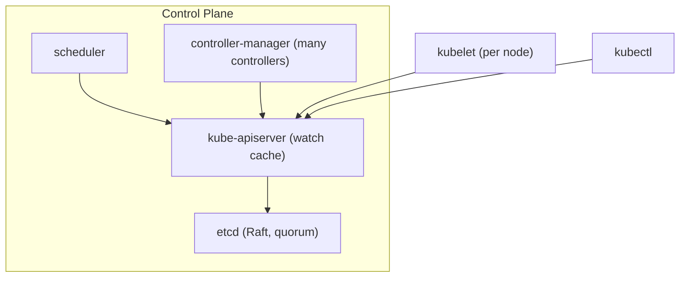
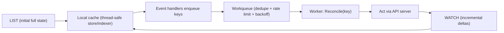

# Module 14 — Control Plane Internals

## TL;DR

The control plane is **etcd** (the single source of truth, made consistent by **Raft**), the **API server** (the only etcd client; does authn/authz/admission and serves a **watch cache**), and **controllers/scheduler** built on the **informer → workqueue → reconcile** pattern with **leader election** for HA. Senior signal here is deep: explain Raft quorum, why watches are cheap, how garbage collection and finalizers work, and how to back up/restore etcd. This is the highest-leverage interview area for "do you really understand Kubernetes."

## Concept

Everything is an object in etcd; the API server mediates all access; controllers reconcile. This module opens the black boxes referenced throughout the guide.



## How It Really Works (Internals)

### etcd and Raft

etcd is a distributed key-value store made consistent by the **Raft** consensus algorithm. Key facts:

- **Quorum = majority** (`(N/2)+1`). With 3 members you tolerate 1 failure; with 5 you tolerate 2. **Even numbers are pointless** (4 still only tolerates 1 but costs more) — run **odd** counts (3 or 5).
- One member is the **leader**; writes go through it and must be acknowledged by a quorum before commit → strong consistency.
- Losing quorum makes the cluster **read-only/unavailable for writes** until restored. This is why etcd HA and backups are paramount.
- etcd uses MVCC and **revisions**; the API server exposes this as `resourceVersion`.

### API server: the only etcd client

No other component touches etcd. The API server:

1. Runs the **request pipeline**: authn → authz (RBAC) → mutating admission → schema validation → validating admission → write to etcd (Module 1/8).
2. Serves a **watch cache**: it maintains an in-memory cache of objects and fans out **watch** streams to clients. So thousands of controllers/kubelets watching don't each hammer etcd — they read from the API server's cache. This is why watches are cheap and scalable.
3. Enforces **optimistic concurrency** via `resourceVersion` compare-and-swap.

### Informers — the controller's engine



An **informer** does one `LIST` to populate a local cache, then a long-lived `WATCH` for changes (tracked by `resourceVersion`; on disconnect it resumes or re-lists). Reads in `Reconcile` hit the **lister** (local cache), not the API server — fast and low-load. Changes enqueue **keys** (namespace/name) onto a **workqueue** that **deduplicates** (collapses bursts), **rate-limits**, and **backs off** failed items. A periodic **resync** re-drives everything (level-triggered self-healing).

### Leader election

For HA, controller-manager and scheduler run multiple replicas, but only one is **active**. They contend for a **Lease** object and renew it; if the holder dies, another acquires the Lease and takes over. This prevents two controllers acting on the same objects simultaneously.

### Garbage collection, owner references, finalizers

- **Owner references** form the object graph (Pod → ReplicaSet → Deployment). The **garbage collector** deletes objects whose owners are gone.
- **Cascading deletion**: `Foreground` (delete dependents first, owner shows `deletionTimestamp` until done), `Background` (delete owner now, dependents async), `Orphan` (leave dependents).
- **Finalizers** block deletion until a controller does cleanup and removes the finalizer key (Module 1) — the mechanism behind stuck namespaces/PVCs.

### Backup & restore (operational must-know)

```bash
# Snapshot etcd
ETCDCTL_API=3 etcdctl snapshot save snap.db \
  --endpoints=https://127.0.0.1:2379 \
  --cacert=/etc/kubernetes/pki/etcd/ca.crt \
  --cert=/etc/kubernetes/pki/etcd/server.crt \
  --key=/etc/kubernetes/pki/etcd/server.key

# Restore creates a new data dir; you then point etcd at it and restart
ETCDCTL_API=3 etcdctl snapshot restore snap.db --data-dir /var/lib/etcd-restored
```

A cluster's entire state can be rebuilt from an etcd snapshot (plus PKI). Backing up etcd is non-negotiable for self-managed clusters.

## Why / When / Trade-offs

- **3 vs 5 etcd members:** 3 is standard (tolerate 1 failure); 5 for higher availability (tolerate 2) at more write latency (larger quorum). Never even numbers.
- **Watch cache vs direct etcd reads:** the cache scales reads massively but can serve slightly stale data; for strict reads clients can request a quorum read (rare). The trade is scalability vs absolute freshness.
- **Stacked vs external etcd:** stacked (etcd on control-plane nodes) is simpler; external etcd isolates failure domains and is preferred for large/critical clusters.
- **Foreground vs background deletion:** foreground guarantees dependents are gone before the owner disappears (cleaner, slower); background is faster but the owner vanishes while children are still being collected.

## Worked Scenario

A self-managed cluster's control-plane node dies and the team realizes they ran **2** etcd members (even). With one left, there's **no quorum** → the API server can't write → the cluster is frozen for changes (existing Pods keep running via autonomous kubelets). Recovery: restore etcd from the latest **snapshot** onto rebuilt members, bring the count to **3**, and verify `etcdctl endpoint health`. Postmortem actions: always odd-sized etcd, automated periodic snapshots stored off-cluster, and tested restore runbooks. They also add control-plane node anti-affinity/topology spread so the members don't share a failure domain.

## Gotchas & Failure Modes

- **Even-sized etcd** — no extra fault tolerance, just cost; use odd.
- **Lost quorum** — writes stop cluster-wide; only an etcd restore recovers it.
- **No etcd backups** — unrecoverable state loss on disk failure.
- **Huge objects / many events** — bloat etcd and slow watches; offload events to a separate etcd or shorten TTL.
- **Stuck finalizer** — object un-deletable until the owning controller removes it.
- **API server overload** — expensive LISTs (no field/label selectors, full re-lists) hammer etcd; well-behaved controllers use informers and selectors.

## Interview Q&A

**Q: What is etcd and how does Raft keep it consistent?**
A: etcd is the strongly-consistent key-value store holding all cluster state. Raft elects a leader and commits a write only after a majority (quorum) of members acknowledge it, guaranteeing a single agreed history. Quorum is `(N/2)+1`, so 3 members tolerate 1 failure, 5 tolerate 2 — always odd counts.

**Q: Why does only the API server talk to etcd?**
A: It centralizes authn/authz/admission/validation and provides a single consistency and caching layer. Controllers and kubelets watch the API server's watch cache instead of etcd directly, which is how the system scales to thousands of watchers without overloading etcd.

**Q: Explain the informer/workqueue pattern.**
A: An informer LISTs to fill a local cache then WATCHes for deltas; reads come from the cache (lister). Changes enqueue object keys onto a workqueue that dedupes, rate-limits, and backs off, and a worker runs an idempotent Reconcile per key. A periodic resync re-drives state for level-triggered self-healing.

**Q: How does leader election work and why is it needed?**
A: HA control-plane components run multiple replicas but acquire/renew a Lease so only one is active; if it stops renewing, another takes over. Without it, two controllers could act on the same objects and conflict.

**Q: How would you back up and restore a cluster's state?**
A: Snapshot etcd with `etcdctl snapshot save` (plus keep the PKI). To recover, `etcdctl snapshot restore` into a fresh data dir, point etcd at it, and restart the control plane. The entire cluster state rebuilds from the snapshot.

**Q: What happens to running workloads if the whole control plane is down?**
A: Existing Pods keep running because kubelets operate autonomously, and kube-proxy keeps routing. You lose scheduling, scaling, self-healing, and any API-driven change until the control plane (and etcd quorum) recovers.

**Q: Why might a namespace be stuck Terminating?**
A: A finalizer on the namespace or on objects within it hasn't been removed — usually the controller responsible for that cleanup (often a CRD's operator) is missing or failing, so deletion blocks until the finalizer is cleared.

## Verify

```bash
kubectl get --raw='/readyz?verbose'                     # API server health
kubectl get leases -n kube-system                       # leader election leases
kubectl get pods -n kube-system -o wide                 # control-plane components (kubeadm/kind)
kubectl delete deploy demo --cascade=foreground -n study # observe foreground GC
# On a control-plane node with etcdctl:
# ETCDCTL_API=3 etcdctl endpoint health
# ETCDCTL_API=3 etcdctl member list
```

## Further Reading

- [etcd](https://etcd.io/docs/) · [Operating etcd for Kubernetes](https://kubernetes.io/docs/tasks/administer-cluster/configure-upgrade-etcd/) · [Raft](https://raft.github.io/)
- [kube-apiserver](https://kubernetes.io/docs/concepts/overview/components/#kube-apiserver) · [API concepts: watch/resourceVersion](https://kubernetes.io/docs/reference/using-api/api-concepts/)
- [Controllers](https://kubernetes.io/docs/concepts/architecture/controller/) · [Leases / Leader Election](https://kubernetes.io/docs/concepts/architecture/leases/)
- [Garbage Collection](https://kubernetes.io/docs/concepts/architecture/garbage-collection/) · [Finalizers](https://kubernetes.io/docs/concepts/overview/working-with-objects/finalizers/)
