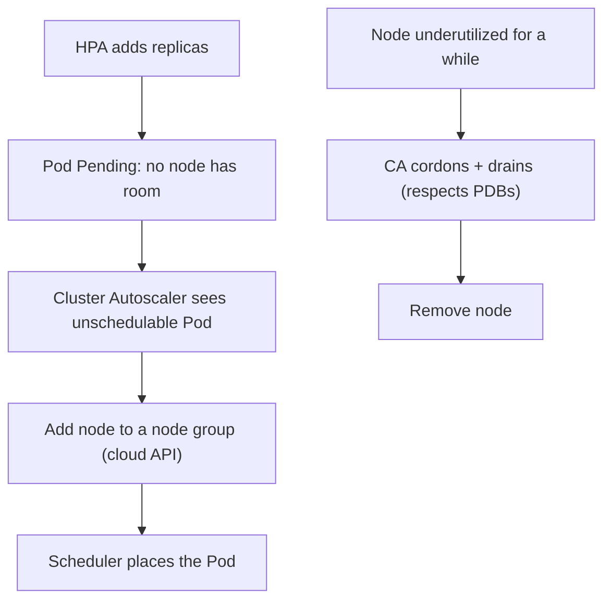

# Module 15 — Autoscaling & Capacity

## TL;DR

Three autoscalers operate on different axes: **HPA** scales replica **count** by metrics; **VPA** scales per-Pod **requests/limits**; **Cluster Autoscaler** scales **node count**. **KEDA** extends HPA to event sources (queues, Kafka lag, cron). They interact: HPA adds Pods → if no node fits, Cluster Autoscaler adds a node. Capacity planning is grounded in **requests** (the scheduling currency) and **eviction thresholds**. Know what each autoscaler watches, what it changes, and where they conflict.

## Concept

| Autoscaler | Watches | Changes | Axis |
|------------|---------|---------|------|
| **HPA** | metrics (CPU/mem/custom/external) | Deployment/StatefulSet `replicas` | scale **out** |
| **VPA** | historical usage | Pod `requests`/`limits` | scale **up** (right-size) |
| **Cluster Autoscaler** | Pending Pods / idle nodes | node count | cluster size |
| **KEDA** | event sources (queue depth, lag, cron) | replicas (drives HPA) | event-driven |

## How It Really Works (Internals)

### HPA (recap + depth)

```
desiredReplicas = ceil( currentReplicas * ( currentMetric / targetMetric ) )
```

- Polls metrics (default ~15s) from the **metrics API** (metrics-server for resource metrics; custom/external via Prometheus Adapter or KEDA).
- Needs **requests** to compute CPU/mem **utilization %**.
- **`behavior`** policies + **stabilization windows** damp flapping (default scale-down stabilization 300s, scale-up 0s) — you can cap how fast it adds/removes Pods.
- Multiple metrics → compute each, take the **max** desired.
- Respated by `minReplicas`/`maxReplicas`.

### VPA

Recommends and (optionally) sets `requests`/`limits` from observed usage. Modes: `Off` (recommend only), `Initial` (set at creation), `Auto`/`Recreate` (update live — **evicts and recreates Pods** to apply, since requests are immutable on a running Pod). **Don't run VPA and HPA on the same resource metric** — VPA changing requests moves HPA's utilization target, and they oscillate. Common safe combo: VPA for memory right-sizing + HPA on a custom/throughput metric.

### Cluster Autoscaler (CA)



- **Scale up:** triggered by **unschedulable (Pending) Pods** — it adds a node from a node group if that would let them schedule. (It reasons on **requests**, not live usage.)
- **Scale down:** removes nodes idle/underutilized for a period, draining Pods (honoring **PDBs** and graceful termination). Pods that can't be moved (no controller, local storage, restrictive PDB, certain annotations) block removal.
- Cloud-specific; alternatives like **Karpenter** provision right-sized nodes just-in-time without fixed node groups.

### Capacity, requests, and eviction

- **requests** are the scheduling currency and what CA/HPA reason about — set them from real usage.
- **Allocatable < capacity**: the node reserves resources for kubelet/system (`--kube-reserved`, `--system-reserved`); Pods schedule against allocatable.
- **Eviction thresholds**: the kubelet evicts Pods under node memory/disk pressure, in QoS order (BestEffort → Burstable over requests → Guaranteed) (Module 7).
- **PriorityClass** governs preemption when capacity is contended (Module 13).

## YAML Example (HPA with behavior)

```yaml
apiVersion: autoscaling/v2
kind: HorizontalPodAutoscaler
metadata: { name: web, namespace: study }
spec:
  scaleTargetRef: { apiVersion: apps/v1, kind: Deployment, name: web }
  minReplicas: 2
  maxReplicas: 10
  metrics:
    - type: Resource
      resource:
        name: cpu
        target: { type: Utilization, averageUtilization: 50 }
  behavior:
    scaleDown:
      stabilizationWindowSeconds: 300   # avoid thrashing on dips
      policies:
        - { type: Percent, value: 50, periodSeconds: 60 }
```

## Why / When / Trade-offs

- **HPA vs VPA:** HPA for stateless workloads that scale horizontally (most web/API); VPA to right-size workloads that don't shard well (some stateful/batch). Avoid both on the same metric.
- **Cluster Autoscaler vs Karpenter:** CA scales predefined node groups; Karpenter provisions optimally-sized nodes on demand (better bin-packing, faster, less node-group management) but is newer and AWS-centric (expanding).
- **Aggressive vs conservative scaling:** fast scale-up improves responsiveness but risks cost spikes and thrash; stabilization windows trade latency for stability.
- **KEDA vs plain HPA:** plain HPA struggles with event-driven/bursty workloads (queue consumers); KEDA scales on queue depth/lag and can scale to **zero** when idle.

## Worked Scenario

A queue-worker Deployment is autoscaled on CPU, but CPU stays low while the queue backs up (work is I/O-bound), so HPA never scales and latency climbs. Fix: adopt **KEDA** with a queue-length trigger so replicas track **backlog**, scaling to zero when empty and surging when the queue grows. As KEDA adds Pods, some go **Pending** (cluster full); **Cluster Autoscaler** sees the unschedulable Pods and adds nodes; when the burst clears, KEDA scales workers down, CA drains and removes the now-idle nodes (respecting a PDB so a minimum stays during the ramp-down). Net: responsive, cost-efficient, event-driven scaling end to end.

## Gotchas & Failure Modes

- **HPA + VPA on same metric** → oscillation.
- **HPA without metrics-server / requests** → no scaling (utilization can't be computed).
- **CA won't remove a node** — a Pod with no controller, local storage, or a strict PDB blocks drain.
- **CA reasons on requests, not usage** — under-set requests let nodes look "full of idle Pods" or overpack; right-size requests.
- **Scale-down thrash** — without stabilization windows, brief dips cause flapping.
- **maxReplicas too low** — HPA silently caps during real load spikes.
- **Scaling stateful workloads** — adding replicas doesn't shard data; HPA on a single-writer DB is meaningless.

## Interview Q&A

**Q: HPA vs VPA vs Cluster Autoscaler — what does each change?**
A: HPA changes the number of Pod replicas based on metrics; VPA changes a Pod's CPU/memory requests/limits to right-size it (recreating Pods to apply); Cluster Autoscaler changes the number of nodes based on Pending Pods and idle nodes. Different axes — they compose.

**Q: Why shouldn't HPA and VPA both target CPU?**
A: VPA adjusts requests, which is the denominator of HPA's utilization %. As VPA changes requests, HPA's measured utilization shifts, and the two chase each other and oscillate. Use them on different signals (e.g. VPA for memory, HPA on a throughput metric).

**Q: What triggers Cluster Autoscaler to add a node?**
A: Unschedulable (Pending) Pods that would fit if a node were added. CA reasons on Pod **requests**, not live usage, and adds a node from an eligible node group. It scales down by draining nodes idle/underutilized over a period, respecting PDBs.

**Q: Derive HPA's desired replicas with numbers.**
A: `ceil(currentReplicas * currentMetric/targetMetric)`. At 4 replicas, 80% CPU, target 50% → ceil(4*1.6)=7. With several metrics it computes each and takes the max, bounded by min/maxReplicas and damped by stabilization windows.

**Q: When do you reach for KEDA?**
A: For event-driven or bursty workloads where the load signal isn't CPU — queue depth, Kafka consumer lag, cron, cloud events. KEDA drives HPA from those sources and can scale to zero when idle, which plain HPA can't.

**Q: How do CA scale-down and PDBs interact?**
A: CA drains a candidate node using the Eviction API, which honors PDBs. If evicting would violate a PDB, the eviction is refused and the node isn't removed until replicas are safely available elsewhere — so PDBs both protect availability and can block scale-down if set too strictly.

## Verify

```bash
kubectl autoscale deployment web --cpu-percent=50 --min=2 --max=10 -n study
kubectl get hpa -n study
kubectl describe hpa web -n study            # current/target metrics, events, scaling decisions
kubectl top pods -n study                    # needs metrics-server (Lab 00 per-tool)
kubectl get nodes -o custom-columns=NAME:.metadata.name,ALLOC_CPU:.status.allocatable.cpu,ALLOC_MEM:.status.allocatable.memory
# Generate load to watch it scale:
kubectl run load --image=busybox:1.36 -n study -- /bin/sh -c "while true; do wget -q -O- http://web; done"
```

> Note: HPA works on any local tool with metrics-server. Cluster Autoscaler needs a cloud node group and won't add nodes on kind/minikube/Rancher Desktop (fixed local capacity) — study its behavior conceptually or on a cloud cluster.

## Further Reading

- [Horizontal Pod Autoscaling](https://kubernetes.io/docs/tasks/run-application/horizontal-pod-autoscale/)
- [Vertical Pod Autoscaler](https://github.com/kubernetes/autoscaler/tree/master/vertical-pod-autoscaler)
- [Cluster Autoscaler](https://github.com/kubernetes/autoscaler/tree/master/cluster-autoscaler) · [Karpenter](https://karpenter.sh/)
- [KEDA](https://keda.sh/) · [Node Allocatable](https://kubernetes.io/docs/tasks/administer-cluster/reserve-compute-resources/)
